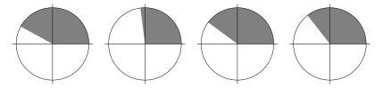

# 📝Definition
An angle greater than $\pi/2$ radians ($90 \degree$) and less than $\pi$ radians ($180 \degree$).

# 🌓Complement
[[acute angle]]

# 🗃Example
Example is the most straightforward way to understand a mathematical concept.

# 🌱Related Elements
The closest pattern to current one, what are their differences?

