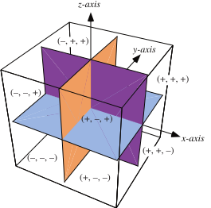

# 📝Definition
One of the eight regions of space defined by the eight possible combinations of signs $(\pm,\pm,\pm)$ for $x, y$, and $z$.

# 🧠Intuition
Find an intuitive way of understanding this concept.

# 📈Diagram

# 🗃Example
Example is the most straightforward way to understand a mathematical concept.

# 🌱Related Elements
The closest pattern to current one, what are their differences?

# 🍂Unorganized