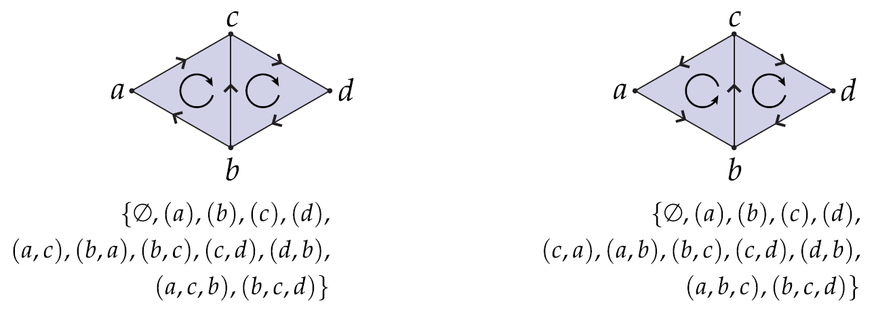

# 📝Definition
An ***oriented simplicial complex*** is a [[simplicial complex]]where each [[simplex]] is assigned an orientation.

# 🧪Composition
An oriented simplicial complex is composed by [[simplex#^fc7728b5477d9d10|oriented simplices]].

# 📈Diagram

# 🧠Intuition
Find an intuitive way of understanding this concept.

# 🗃Example
Example is the most straightforward way to understand a mathematical concept.

# 🌱Related Elements
The closest pattern to current one, what are their differences?

# 🍂Unorganized