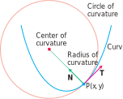
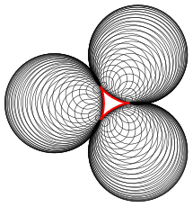
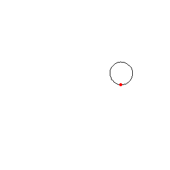
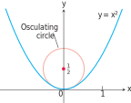

# 📝Definition
The osculating circle at a point $P$ on a plane curve where $\kappa \neq 0$ is the circle in the plane of the curve that
1. is tangent to the curve at $P$ (has the same [[tangent line]] the curve has)
2. has the same [[curvature]] the curve has at $P$
3. has center that lies toward the concave or inner side of the curve
The radius of curvature of the curve at $P$ is the radius of the circle of curvature, which is
$$
\text{Radius of curvature}=\rho=\frac{1}{\kappa}.
$$
To find $\rho$, we find $\kappa$ and take the reciprocal. The center of curvature of the curve at $P$ is the center of the circle of curvature.

# 📈Diagram

# 🧠Intuition
Find an intuitive way of understanding this concept.

# 🗃Example
- 📁osculating circle example
	- 💬Question: Find and graph the osculating circle of the parabola $y = x^2$ at the origin.
	- 🏹Strategy:
		- To graph the osculating circle, we need to find its curvature.
	- ✏Solution:
		- Recall what is curvature.
			- $\kappa=\frac{\lVert\mathbf{T}'(t)\rVert}{\lVert\mathbf{r}'(t)\rVert}$
		- To fully calculate, we need to find the parameterization for the parabola.
			- That is $\mathbf{r}(t)=t\mathbf{i}+t^2\mathbf{j}$.
		- Find $\lVert\mathbf{r}'(t)\rVert$
			- Find $\mathbf{r}'(t)$
				- $\mathbf{r}'(t)=\mathbf{i}+2t\mathbf{j}$
			- Find $\lVert\mathbf{r}'(t)\rVert$
				- $\lVert\mathbf{r}'(t)\rVert=\sqrt{(1)^2+(2t)^2}=\sqrt{1+4t^2}$
		- Find $\lVert\mathbf{T}'(t)\rVert$
			- Find $\mathbf{T}(t)$
				- $\mathbf{T}(t)=\frac{\mathbf{r}'(t)}{\lVert\mathbf{r}'(t)\rVert}=\frac{\mathbf{i}+2t\mathbf{j}}{\sqrt{1+4t^2}}=(1+4t^2)^{-\frac{1}{2}}\mathbf{i}+\frac{2t}{(1+4t)^{\frac{1}{2}}}\mathbf{j}$
			- Find $\mathbf{T}'(t)$
				- it's really complicate... need patience...
				- $$\mathbf{T}'(t)=\left(-4t(1+4t^2)^{-\frac{3}{2}}\right)\mathbf{i}+\left(2(1+4t^2)^{-\frac{1}{2}}-8t^2(1+4t^2)^{-\frac{3}{2}}\right)\mathbf{j}$$
			- Find $\lVert\mathbf{T}'(t)\rVert$
				- $\lVert\mathbf{T}'(t)\rVert=\sqrt{\left(-4t(1+4t^2)^{-\frac{3}{2}}\right)^2+\left(2(1+4t^2)^{-\frac{1}{2}}-8t^2(1+4t^2)^{-\frac{3}{2}}\right)^2}$
		- The radius is
			- $\text{radius}=\frac{1}{\kappa}=\frac{1}{\frac{\lVert\mathbf{T}'(t)\rVert}{\lVert\mathbf{r}'(t)\rVert}}=\frac{\lVert\mathbf{r}'(t)\rVert}{\lVert\mathbf{T}'(t)\rVert}$
			- Since we are at the origin and therefore $t=0$.
				- $\lVert\mathbf{r}'(t)\rVert=1$
				- $\lVert\mathbf{T}'(t)\rVert=2$
			- $\text{radius}=1/2$
		- Therefore the graph is
			- 

# 🌱Related Elements
The closest pattern to current one, what are their differences?

# 🍂Unorganized