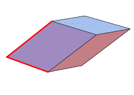

https://mathworld.wolfram.com/Parallelepiped.html
# 📝Definition

# 🧠Intuition
Find an intuitive way of understanding this concept.

📈Diagram

# 🗃Example
Example is the most straightforward way to understand a mathematical concept.

# 🌱Related Elements
The closest pattern to current one, what are their differences?

# 🍂Unorganized