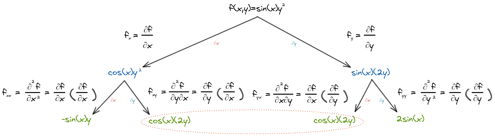

# 📝Definition
A partial derivative of a function of several variables is its [[derivative]] with respect to one of those variables, with the others held [[constant]] (as opposed to the total derivative, in which all variables are allowed to vary).

# ✒Notation
The partial derivative of a function $f(x,y,\dots )$ with respect to the variable $x$ is variously denoted by
$$
f_{x}, f'_{x},\partial _{x}f, \ D_{x}f, D_{1}f, \frac{\partial }{\partial x}f, \frac {\partial f}{\partial x}.
$$
> 🙄... that's really a lots of representation!

> [!note]
> The symbol $\partial$ is actually $d$ in [[Leibniz Notation]] but tilted on the top to indicate this is "partial" derivative. (the rate of change of the function in the $x$-direction.) 

**🖋Notation on higher order partial derivative**
Suppose there is a function $f(x,y)$. Its second partial derivative can be written as
- Function: $f(x)$
	- first order partial derivative on $\textcolor{red}x$
		- $\frac{\partial f}{\partial \textcolor{red}x}$
		- $f_{\textcolor{red}x}$
		- second order partial derivative on $\textcolor{red}x$
			- $\frac{\partial}{\partial \textcolor{red}x}(\frac{\partial f}{\partial \textcolor{red}x})$
			- $\frac{\partial^2 f}{\partial \textcolor{red}{x}^2}$
			- $f_{\textcolor{red}{xx}}$
		- second order partial derivative on $\textcolor{blue}y$
			- $\frac{\partial}{\partial \textcolor{blue}y}(\frac{\partial f}{\partial \textcolor{red}x})$
			- $\frac{\partial^2 f}{\partial \textcolor{blue}y\partial \textcolor{red}x}$
			- $f_{\textcolor{red}x\textcolor{blue}y}$
	- first order partial derivative on $\textcolor{blue}y$
		- $\frac{\partial f}{\partial \textcolor{blue}y}$
		- $f_\textcolor{blue}y$
		- second order partial derivative on $\textcolor{red}x$
			- $\frac{\partial}{\partial \textcolor{red}x}(\frac{\partial f}{\partial y})$
			- $\frac{\partial^2 f}{\partial \textcolor{red}x\partial y}$
			- $f_{y\textcolor{red}x}$
		- second order partial derivative on $\textcolor{blue}y$
			- $\frac{\partial}{\partial \textcolor{blue}y}(\frac{\partial f}{\partial \textcolor{blue}y})$
			- $\frac{\partial^2}{\partial \textcolor{blue}y^2}$
			- $f_{\textcolor{blue}{yy}}$

> [!tip]
> The $\frac{\partial^2}{\partial y\partial x}$ notation reads from **right to left**. Similar to [[matrix]] multiplication. 
> The $f_{xy}$ notation reads from **left to right**.

# 🧠Intuition
Find an intuitive way of understanding this concept.

# 🗃Example
- **🗂 partial derivative example 1**
	- 💬Question: For the function $$f(x,y)=x^2y+\sin(y)$$
		- (A)Solve the partial derivative in $x$ and $y$ direction of $(1,2)$ of function
		- (B)Solve the partial derivative in $x$ and $y$ direction in general
	- ✏Solution:
		- (A)
			- First we can write down the partial derivative in $x$ direction
				- $$\frac{\partial f}{\partial x}(1,2)$$
			- Since it is just evaluating at $x$ direction and therefore $y$ is constant, we can express that in the following. Just plug in $y=2$
				- $$\begin{align}\frac{\partial f}{\partial x}(1,2)&=\frac{\partial f}{\partial x}(x^2\cdot2+\sin(2))|_{x=1}\\&=\frac{\partial f}{\partial x}(2x^2+\sin(2))|_{x=1}\\&=4x+0|_{x=1}=4\end{align}$$
			- Second we process the $y$ direction which is almost the same.
				- $$\begin{align}\frac{\partial f}{\partial y}(1,2)&=\frac{\partial f}{\partial y}(1^2y+\sin(y))|_{y=2}\\&=1+\cos(y)|_{y=2}=1+\cos(2)\end{align}$$
		- (B)Computing at certain point helps you understand the concept, while in practice, we care much more about the general equation.
			- For $x$ direction,
				- The partial derivative of function $$f(x,y)=x^2y+\sin(y)$$ in $x$ direction can be written as
					- $$\frac{\partial f}{\partial x}(x,y)=x^2y+\sin(y)$$
				- Since we are on $x$ direction, and therefore the $y$ should be considered as $\textcolor{red}{\text{constant}}$. We can take the derivative and, at the same time, pretend $y$ is $\textcolor{red}{\text{constant}}$.
					- $$\begin{align}\frac{\partial f}{\partial x}(x,y)&=x^2\textcolor{red}y+\sin(\textcolor{red}y)\\&=2x\textcolor{red}y+0\end{align}$$
			- For $y$ direction, it's pretty much the same.
				- Write the formula.
					- $$\frac{\partial f}{\partial y}(x,y)=x^2y+\sin(y)$$
				- Treat $x$ as $\textcolor{red}{\text{constant}}$
					- $$\begin{align}\frac{\partial f}{\partial y}(x,y)&=\textcolor{red}{x^2}y+\sin(y)\\&=\textcolor{red}{x^2}+\cos(y)\end{align}$$

- **📩second order partial derivative notation example 1**
	- 💬Question: Compute the second order partial derivative of function $$f(x,y)=\sin(x)y^2$$
	- ✏Solution:
		- 

# 🌱Related Elements
The closest pattern to current one, what are their differences?

# 🍂Unorganized