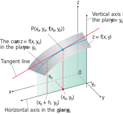
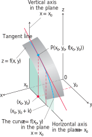
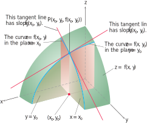
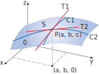
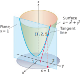

# 📝Definition
## 📄Definition - general
A partial derivative of a function of several variables is its [[derivative]] with respect to one of those variables, with the others held [[constant]] (as opposed to the total derivative, in which all variables are allowed to vary).

## 📑Definition - geometric
The partial derivative of $f(x, y)$ with respect to $\textcolor{red}x$ at the point $(x_0 , y_0)$ is
$$
\frac{\partial f}{\partial \textcolor{red}x}|_{(x_0,y_0)}=\lim_{h\to0}\frac{f(x_0+h,y_0)-f(x_0,y_0)}{h},
$$
provided the limit exists.

> [!info] Remark
> When we say "partial", we focus the derivative only on ==1== variable. In the meantime, we assume others are constant. For example, we make an arbitrary plane of $y=y_0$ when we take the partial derivative respect to $x$.

Respectively, we can have the partial derivative of $y$ as followed.
The partial derivative of $f(x, y)$ with respect to $\textcolor{blue}y$ at the point $(x_0 , y_0)$ is
$$
\frac{\partial f}{\partial \textcolor{blue}y}|_{(x_0,y_0)}=\lim_{h\to0}\frac{f(x_0,y_0+h)-f(x_0,y_0)}{h},
$$
provided the limit exists.

> [!info] Remark
> Notice that we now have two tangent lines associated with the surface $z = f(x, y)$ at the point $P(x_0, y_0, f(x_0, y_0))$. Is the [[plane]] they determine tangent to the surface at $P$?
> 
> 

# ✒Notation
The partial derivative of a function $f(x,y,\dots )$ with respect to the variable $x$ is variously denoted by
$$
f_{x}, f'_{x},\partial _{x}f, \ D_{x}f, D_{1}f, \frac{\partial }{\partial x}f, \frac {\partial f}{\partial x}.
$$
> 🙄... that's really a lots of representation!

> [!note]
> The symbol $\partial$ is actually $d$ in [[Leibniz notation]] but tilted on the top to indicate this is "partial" derivative. (the rate of change of the function in the $x$-direction.) 

**🖋Notation on higher order partial derivative**
Suppose there is a function $f(x,y)$. Its second partial derivative can be written as
- Function: $f(x)$
	- first order partial derivative on $\textcolor{red}x$
		- $\frac{\partial f}{\partial \textcolor{red}x}$
		- $f_{\textcolor{red}x}$
		- second order partial derivative on $\textcolor{red}x$
			- $\frac{\partial}{\partial \textcolor{red}x}(\frac{\partial f}{\partial \textcolor{red}x})$
			- $\frac{\partial^2 f}{\partial \textcolor{red}{x}^2}$
			- $f_{\textcolor{red}{xx}}$
		- second order partial derivative on $\textcolor{blue}y$
			- $\frac{\partial}{\partial \textcolor{blue}y}(\frac{\partial f}{\partial \textcolor{red}x})$
			- $\frac{\partial^2 f}{\partial \textcolor{blue}y\partial \textcolor{red}x}$
			- $f_{\textcolor{red}x\textcolor{blue}y}$
	- first order partial derivative on $\textcolor{blue}y$
		- $\frac{\partial f}{\partial \textcolor{blue}y}$
		- $f_\textcolor{blue}y$
		- second order partial derivative on $\textcolor{red}x$
			- $\frac{\partial}{\partial \textcolor{red}x}(\frac{\partial f}{\partial y})$
			- $\frac{\partial^2 f}{\partial \textcolor{red}x\partial y}$
			- $f_{y\textcolor{red}x}$
		- second order partial derivative on $\textcolor{blue}y$
			- $\frac{\partial}{\partial \textcolor{blue}y}(\frac{\partial f}{\partial \textcolor{blue}y})$
			- $\frac{\partial^2}{\partial \textcolor{blue}y^2}$
			- $f_{\textcolor{blue}{yy}}$

> [!tip]
> The $\frac{\partial^2}{\partial y\partial x}$ notation reads from **right to left**. Similar to [[matrix]] multiplication. 
> The $f_{xy}$ notation reads from **left to right**. Why is that? If I wrote $f_{xy}=(f_x)_y$, and you will better understand this. 

# 🧠Intuition
$z=f(x,y)$ represents a surface $S$ (the graph of $f$ ). If $f(a,b)=c$, then the point $P(a, b, c)$ lies on $S$. 

- By fixing $y = b$, we are restricting our attention to the curve $C_1$ in which the vertical plane $y = b$ intersects $S$. (In other words, $C_1$ is the trace of $S$ in the plane $y = b$.
- Likewise, the vertical plane $x=a$ intersects $S$ in a curve $C_2$.
Both of the curves $C_1$ and $C_2$ pass through the point $P$.
> [!info] Remark
> Note that
> - the curve $C_1$ is the graph of the function $g(x)=f(x,b)$, so the slope of its tangent $T_1$ at $P$ is $g'(a)=f_x(a,b)$.
> - the curve $C_2$ is the graph of the function $h(y)=f(a,y)$, so the slope of its tangent $T_2$ at $P$ is $h'(b)=f_y(a,b)$.

Thus the partial derivatives $f_x(a,b)$ and $f_y(a,b)$ can be interpreted geometrically as the slopes of the tangent lines at $P(a, b, c)$ to the traces $C_1$ and $C_2$ of $S$ in the planes $y = b$ and $x = a$.

# 🗃Example
- **🗂 partial derivative example 1**
	- 💬Question: For the function $$f(x,y)=x^2y+\sin(y)$$
		- (A)Solve the partial derivative in $x$ and $y$ direction of $(1,2)$ of function
		- (B)Solve the partial derivative in $x$ and $y$ direction in general
	- ✏Solution:
		- (A)
			- First we can write down the partial derivative in $x$ direction
				- $$\frac{\partial f}{\partial x}(1,2)$$
			- Since it is just evaluating at $x$ direction and therefore $y$ is constant, we can express that in the following. Just plug in $y=2$
				- $$\begin{align}\frac{\partial f}{\partial x}(1,2)&=\frac{\partial f}{\partial x}(x^2\cdot2+\sin(2))|_{x=1}\\&=\frac{\partial f}{\partial x}(2x^2+\sin(2))|_{x=1}\\&=4x+0|_{x=1}=4\end{align}$$
			- Second we process the $y$ direction which is almost the same.
				- $$\begin{align}\frac{\partial f}{\partial y}(1,2)&=\frac{\partial f}{\partial y}(1^2y+\sin(y))|_{y=2}\\&=1+\cos(y)|_{y=2}=1+\cos(2)\end{align}$$
		- (B)Computing at certain point helps you understand the concept, while in practice, we care much more about the general equation.
			- For $x$ direction,
				- The partial derivative of function $$f(x,y)=x^2y+\sin(y)$$ in $x$ direction can be written as
					- $$\frac{\partial f}{\partial x}(x,y)=x^2y+\sin(y)$$
				- Since we are on $x$ direction, and therefore the $y$ should be considered as $\textcolor{red}{\text{constant}}$. We can take the derivative and, at the same time, pretend $y$ is $\textcolor{red}{\text{constant}}$.
					- $$\begin{align}\frac{\partial f}{\partial x}(x,y)&=x^2\textcolor{red}y+\sin(\textcolor{red}y)\\&=2x\textcolor{red}y+0\end{align}$$
			- For $y$ direction, it's pretty much the same.
				- Write the formula.
					- $$\frac{\partial f}{\partial y}(x,y)=x^2y+\sin(y)$$
				- Treat $x$ as $\textcolor{red}{\text{constant}}$
					- $$\begin{align}\frac{\partial f}{\partial y}(x,y)&=\textcolor{red}{x^2}y+\sin(y)\\&=\textcolor{red}{x^2}+\cos(y)\end{align}$$

- **📩second order partial derivative notation example 1**
	- 💬Question: Compute the second order partial derivative of function $$f(x,y)=\sin(x)y^2$$
	- ✏Solution:
		- 
		- We noticed that $f_{xy}$ and $f_{yx}$ are the same. See [[Clairaut’s Theorem]]

- 📁**partial derivative example 2**
	- 💬Question: The plane $x = 1$ intersects the paraboloid $z = x^2 + y^2$ in a [[parabola]]. Find the slope of the tangent to the parabola at $(1, 2, 5)$
	- ✏Solution:
		- The slope is the value of the partial derivative $\partial z / \partial y$ at $(1, 2)$:
			- $$\frac{\partial z}{\partial y}\bigg|_{(1,2)}=\frac{\partial z}{\partial y}(x^2+y^2)\bigg|_{(1,2)}=2y\bigg|_{(1,2)}=2(2)=4$$
		- As a check, we can treat the parabola as the graph of the *single-variable* function $z = (1)^2 + y^2 = 1 + y^2$ in the plane $x = 1$ and ask for the slope at $y = 2$.
		- 

# 🌱Related Elements
The closest pattern to current one, what are their differences?

# 🍂Unorganized