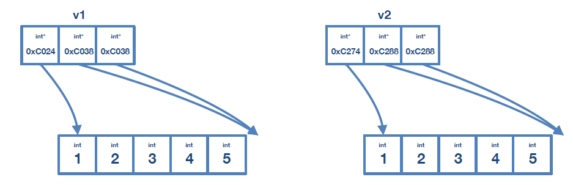

# 📝Definition
The name is the essence of this topic.
- this is the **default** behavior of all types in #cpp 
- this is the default behavior of only [[Value Type]] in #csharp 

# 📈Diagram
From the diagram below, you can see "pass by value" is actually making a full copy (see the difference of address).
```cpp
std::vector<int> v1{1, 2, 3, 4, 5};
std::vector<int> v2;

v2 = v1;
```


# 🗃Example
## A solid example across different "pass-by-??what??"
**📌pass by value**
```cpp
class Widget{};       //define a class
void func(Widget w);  //w is pass by value

Widget x;
func( x );            //call with an lvalue - valid✅
func( Widget{} );     //call with an rvalue - valid✅
```
**key takeaway**: call `func()` will get a copy of the passed data.

**📌pass by lvalue reference**
```cpp
class Widget{};       //define a class
void func(Widget & w);  //w is pass by lvalue reference

Widget x;
func( x );            //call with an lvalue - valid✅
func( Widget{} );     //call with an rvalue - ERROR❌
```
**key takeaway**: call `func()` can modify the caller's data, caller sees changes.

**📌pass by const reference**
```cpp
class Widget{};       //define a class
void func(const Widget & w);  //w is pass by const reference

Widget x;
func( x );            //call with an lvalue - valid✅
func( Widget{} );     //call with an rvalue - valid✅
```
**key takeaway**: call `func()` can not modify caller's data.

We might be wondering why `const` reference works for both [[value categories|lvalue]] and [[value categories|rvalue]]? 
Since there is no visibility for those values, therefore we can pass either lvalue and rvalue.

**📌pass by rvalue reference**
```cpp
class Widget{};       //define a class
void func(Widget && w);  //w is pass by rvalue reference

Widget x;
func( x );            //call with an lvalue - ERROR❌
func( Widget{} );     //call with an rvalue - valid✅
```
**key takeaway**: call `func()` can modify caller's data, caller can not see changes.


# 🙋‍♂️Related Elements
 The closest element to current one, what are their differences?
![[pass-by-reference#^75db37bf4ac72c6b]]
