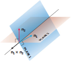

https://mathworld.wolfram.com/Plane-PlaneIntersection.html
# 📝Definition
lines are parallel if and only if they have the same direction, two planes are parallel if and only if their [[normal vector|normal]]s are parallel, or $\mathbf{n}_1 = k\mathbf{n}_2$ for some scalar $k$. Two planes that are not parallel **intersect** in a [[line]].

# 🧠Intuition
Find an intuitive way of understanding this concept.

# 🗃Example
Example is the most straightforward way to understand a mathematical concept.

# 🌱Related Elements
The closest pattern to current one, what are their differences?

# 🍂Unorganized