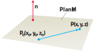

# 📝Definition
Suppose that:
- $M$ - a plane
- $P_0(x_0, y_0, z_0)$ - a point that the plane $M$ passes through
- $\mathbf{n} = A\mathbf{i} + B\mathbf{j} + C\mathbf{k}$ - the nonzero vector is normal to $M$

Then $M$ is the set of all points $P(x, y, z)$ for which $P_0 P$ is [[orthogonal vectors|orthogonal]] to $\mathbf{n}$. Thus, the dot product is
$$
\mathbf{n}\cdot \overrightarrow{P_0 P} = 0.
$$
This equation is equivalent to
$$
\underbrace{(A\mathbf{i} + B\mathbf{j} + C\mathbf{k})}_{\mathbf{n}} \cdot \underbrace{\left[(x - x_0)\mathbf{i} + (y - y_0)\mathbf{j} + (z - z_0)\mathbf{k}\right]}_{\overrightarrow{P_0 P}} = 0,
$$
by expanding the [[inner product|dot product]], the plane $M$ consists of the points $(x, y, z)$ satisfying
$$
A(x - x_0) + B( y - y_0) + C(z - z_0) = 0.
$$

> [!info] Remark
> The generalization of the plane to higher dimensions is called a [[hyperplane]].

# 🧠Intuition
A plane in space is determined by knowing a point on the plane and its “tilt” or orientation. This “tilt” is defined by specifying a vector that is perpendicular or normal to the plane.
> [!info] Remark
> This is exactly the most common way to define a plane in #RhinoCommon.
> `public Plane(Point3d origin,Vector3d normal)`

# ✒Notation
The plane through $P_0(x_0, y_0, z_0)$ normal to $\mathbf{n} = A\mathbf{i} + B\mathbf{j} + C\mathbf{k}$ has
- **🖋vector equation**
	- $\mathbf{n}\cdot \overrightarrow{P_0 P} = 0.$
- **✏component equation** ^95fad6
	- $A(x - x_0) + B( y - y_0) + C(z - z_0) = 0.$
- **🖊component equation simplified** ^cdb60f
	- $Ax + By + Cz = D$
		- where
		- $D=Ax_0 + By_0 + Cz_0$
- 🖍**Hessian Normal Form**
	- see [[Hessian normal form]]

🖋
✏
🖊

🖌

# 🗃Example
- 📁plane example 1
	- 💬Question: Find an equation for the plane through $P_0(-3, 0, 7)$ perpendicular to $\mathbf{n} = 5\mathbf{i} + 2\mathbf{j} -\mathbf{k}$.
	- ✏Solution:
		- Use [[plane#^95fad6|component equation]]
			- The component equation is
				- $5(x - (-3)) + 2(y - 0) + (-1)(z - 7) = 0.$
			- Simplifying, we obtain
				- $$\begin{align}5x + 15 + 2y - z + 7 &= 0\\5x + 2y - z &= -22.\end{align}$$
		- Use [[plane#^cdb60f|component equation simplified]]
			- The component equation simplified is
				- $5x + 2y - z =D$
			- Solve $D$
				- $D=(-3)(5)+(0)(2)+(7)(-1)=-22$
			- Finally, we obtain
				- $5x + 2y - z = -22$
	- 📜Key Takeaway: The later method is good for computation since its 1st step just to grasp sth.

# 💫Operation
## 🌠angle between planes
See [[dihedral angle]]
## 🔮Lines of Intersection
See [[plane-plane intersection]]
☄
🌌
🥏
🌀

# 🌱Related Elements
The closest pattern to current one, what are their differences?

# 🍂Unorganized