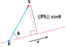
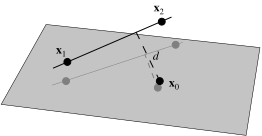
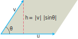

# 📝Definition
**📄Definition**
The distance from a point $S$ to a line through $P$ parallel to $\mathbf{v}$.
$$
d=\frac{\lVert\overrightarrow{PS}\times\mathbf{v}\rVert}{\lVert\mathbf{v}\rVert}.
$$

___
**📑Definition**
Let a line in 3 dimensions be specified by two points $\mathbf{x_1}=(x_1,y_1,z_1)$ and $\mathbf{x_2}=(x_2,y_2,z_2)$ lying on it, so a vector along the line is given by
$$
v=
\begin{bmatrix}
x_1+(x_2-x_1)t\\y_1+(y_2-y_1)t\\z_1+(z_2-z_1)t
\end{bmatrix}.
$$
The distance from point $\mathbf{x_0}=(x_0,y_0,z_0)$ to the line formed by $\mathbf{x_1}$ and $\mathbf{x_2}$ is
$$
d=\frac{\lVert(\mathbf{x_0}-\mathbf{x_1})\times(\mathbf{x_0}-\mathbf{x_2})\rVert}{\lVert\mathbf{x_2}-\mathbf{x_1}\rVert}
$$

___
> [!info] Remark
> The $\times$ denotes [[cross product]].

# 🧠Intuition
Find an intuitive way of understanding this concept.

# 🗃Example
- 📂example 1 ^35cd77
	- 💬Question: Find the distance from the point $S(1, 1, 5)$ to the line $L$ which written as parametric equation.
		- $L:\quad x = 1 + t,\quad y = 3 - t , \quad z = 2t.$
	- ✏Solution:
		- Think about what is $P$?
			- That is $(1,3,0)$
		- Think about what is $\overrightarrow{PS}$.
			- That is $\overrightarrow{PS}=S-P=(1,1,5)-(1,3,0)=(0,-2,5)$
		- What is vector $\mathbf{v}$?
			- $(1,-1,2)$
		- From the equation, we can have.
			- `norm(cross(PS,v))/norm(v)`

# 🗿Socratic Method
- **💬Question**: Why this equation work?
- **🗣Answer**: It can be derived from the [[cross product]]!
- **✍Argument**:
	- The [[L2-norm|Euclidean Norm]] $\lVert\overrightarrow{PS}\times\mathbf{v}\rVert$ is the area of the [[parallelogram]].
		- 
	- When divide with $\lVert \mathbf{v} \rVert$, it becomes $\frac{\lVert\overrightarrow{PS}\times\mathbf{v}\rVert}{\lVert\mathbf{v}\rVert}$.
	- What is that?!
	- It is exactly the height!
- **📜Key Takeaway**:
	- Think about the essence of cross product.
___
- **💬Question**: Why the position of $P$ actually not that important?
	- For example in [[point-line distance#^35cd77]], if I change a point on that line, does it affect the outcome?
- **🗣Answer**: It does not affect!
- **✍Argument**:
	- Taste the equation $\frac{\lVert\overrightarrow{PS}\times\mathbf{v}\rVert}{\lVert\mathbf{v}\rVert}$ one more time.
	- Move $P$ is just like moving an anchor point of a parallelogram! The height would not be changed!!
- **📜Key Takeaway**:
	- The height is an invariant due to its essence of geometry.

# 🌱Related Elements
The closest pattern to current one, what are their differences?

# 🍂Unorganized