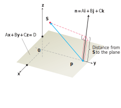

# 📝Definition
**📄Definition**
The point-plane distance from a point $\mathbf{x}_0$ to a plane in [[Hessian normal form]] is given by the simple equation
$$
D=\hat{\mathbf{n}}\cdot\mathbf{x}_0+p.
$$
> [!info] Remark
> - If the point $\mathbf{x}_0$ is in the [[half-space]] determined by the direction of $\hat{\mathbf{n}}$, then $D>0$.
> - If it is in the other half-space, then $D<0$.

___

**📑Definition**
If $P$ is a point on a plane with normal $\mathbf{n}$, then the distance from any point $S$ to the plane is the length of the vector projection of $\overrightarrow{PS}$ onto $\mathbf{n}$. That is, the distance from $S$ to the plane is
$$
d=\left|\overrightarrow{PS}\cdot\frac{\mathbf{n}}{\lVert\mathbf{n}\rVert}\right|
$$
where $\mathbf{n}=A\mathbf{i} + B\mathbf{j} + C\mathbf{k}$ is the [[normal vector|normal]] to the plane.

> [!info] Remark
> The equation is merely [[vector projection]]. The distance is the shadow.
> 

# 🧠Intuition
Find an intuitive way of understanding this concept.

# 🗃Example
- 📁point-plane distance example 1
	- 💬Question: Find the distance from $S(1, 1, 3)$ to the plane $3x + 2y + 6z = 6$.
	- ✏Solution:
		- Arbitrarily select a point from the plane.
			- plug $x=0,y=0$.
			- got $6z=6, z=1$
			- therefore $P=(0,0,1)$
		- $\overrightarrow{PS}=S-P=(1,1,2)$
		- $\mathbf{n}=(3,2,6)$
		- From $d=\left|\overrightarrow{PS}\cdot\frac{\mathbf{n}}{\lVert\mathbf{n}\rVert}\right|$, we have
		- `dot(PS,n)/norm(n)`
		- the result is $17/7$.

# 🌱Related Elements
The closest pattern to current one, what are their differences?

# 🍂Unorganized