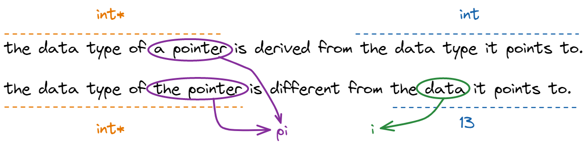

# 📝Definition
A pointer is a variable that stores the [[memory|memory address]] of an object.

When seeing pointer in the scope of [[type|data type]], a pointer data type is:
- the data type of a pointer is derived from the data type it points to.
- the data type of the pointer is different from the data it points to.

For example,
```cpp
int i = 13;
int *pi = &i;
```


# 🧠Intuition
You can see the pointers as arrows in the memory.


# 🎯Intent
Pointers are used extensively in both C and C++ for three main purposes:
- to allocate new objects on the heap
- to pass functions to other functions
- to iterate over elements in arrays or other data structures


# 🚀Benefit / Pro
A *pointer* introduces a level of **indirection** to a program. Rather than <u>manipulate an object directly</u>😑, we <u>manipulate a pointer that holds the address of an object</u>😍.

# 💊Cons
A pointer does not know how many elements it points to.

# 🏷(Sub)Categories
- In C++, there are 2 main categories.
    - raw pointer
    - [[Smart Pointer]]
    - [[null pointer]]
    - [[this keyword|this pointer]]
    - [[dangling pointer]]

# ✒Notation
In #cpp ,
```cpp
double*
```
We say `double*` as "pointer to `double`".

> [!NOTE] Note⭐
> It is important to note that the [[asterisk|*]] symbol used to indicate that a variable is a pointer belongs syntactically **with the variable name** and **not with the base type**. It should answer the confusion between `int* i` and `int *i`. I would prefer the latter since it is the `*` makes the variable different.

Suppose you want to declare 2 pointers to `int`.
```cpp
int *p1, *p2;  //✅
int *p1, p2;  //❌
```

# 🧪Composition
Suppose you have the following codes:
```cpp
int i = 13;
char *cptr;
int *iptr = &i;
```
## target
The value at the address specified by a pointer is called its target.
## base type
The type of that target value is called the base type for the pointer.

# ⌨Sample Code
- 
  ``` cpp
  int ival = 1024;
  int* pi;             // pi is a pointer to an object of type int
  &ival;               // evaluates to the address of ival by using `&`
  pi = &ival;          // pass the address of ival to pi
  ```
- sample on different style of C++ raw pointer
    - 
      ``` cpp
      int* pi = &ival;
      int *pi = &ival;
      ```
    - I personally favor the second version which seeing that the `*` affects the declarator-id directly.
    - 
      ``` cpp
      // pi is a pointer to int
      // pt2 is an int
      int* pi, pi2;
      
      // pi3 is a pointer to int
      // pi4 is a pointer to int
      int* pi3, * pi4;
      ```
    - Use `T *p` rather than ~~`T* p`~~
    
- example on guarding against dereferencing a null pointer ^40c7cc02dd9c4f77
    - 
      ``` c++
      // safe check
      if (pi && *pi!=1024)
      {
          *pi = 1024;
      }
      
      // modern check null pointer
      if (nullptr != pi && *pi!=1024)
      {
          *pi = 1024;
      }
      ```


# 🌓Complement
![[Reference Type#🌓Complement#🌗reference type data type vs. pointer type data type]]

# 💫Operation
Operations related to pointer in #cpp 
- 1️⃣take the address using `&` - [[address-of operator]]
- 2️⃣dereference using `*` - [[dereference operator]]
- 3️⃣manipulate the data member using `->` [[Member access operator]] 
- 4️⃣indexing using `[]`⭐
- 5️⃣check the nullness by using [[null pointer|nullptr]]
- 6️⃣[[pointer#💫Operation#pointer arithmetic]]
- 7️⃣[[pointer#💫Operation#pointer type conversion]]

```cpp
// code for 4️⃣
constexpr int SIZE = 8;
double *elems{new double[SIZE]};
for(int ii = 0; ii < SIZE; ++ii)
{
	elems[ii]=ii;  //set using `[]`
}
double elem = elems[3];  //get using `[]`
```

```cpp
// code for 5️⃣
int *pi;
if(pi) {/*do sth*/}  //1st style
if(pi != nullptr) {/*do sth*/}  //2nd style
```

Opinion varies in light of preceding check nullness. 
- #BjarneStroustrup prefers the 1st.
- Others may prefer the 2nd.


## pointer arithmetic
**📌`++p` vs. `p++`**
Suppose you have a pointer `p`, do you see any difference on `++p` and `p++`.
- In terms of **performance**
  - for built-in type, no difference
  - for other type, `++p` version performs better
- In terms of **arithmetic**
  - `p++` incremented after assignment
  - `++p` incremented before assignment


## pointer type conversion
**😶Unsafe Behavior - directly cast different pointer**
```cpp
Gadget *pg;
Widget *pw;

pg = pw;  // COMPILE ERR❌
pw = pg;  // COMPILE ERR❌
```
Directly casting different type of pointer will cause compile error.
```cpp
pg = reinterpret_cast<Gadget *>(pw);
pw = reinterpret_cast<Widget *>(pg);
```
The preceding codes have no compile errors but will have runtime error!!

**😶Unsafe Behavior - cast to unrelated type**
```cpp
int i;
double *pd = reinterpret_cast<double *>(&i);
*pd = 3;  // UNDEFINED BEHAVIOR👻
```

**😊Safe Behavior - Pointer to derived class cast to base class**
```cpp
Derived d;
Base *pb = &d;
```

# 🕳Pitfalls

> [!bug] Bugs
> There are 2 main severe bugs on using pointer:
> - access through uninitialized pointers
> - access pointer in out-of-range situation

- Pitfall on undefined behavior
    - Description
        - dereference a null C/C++ raw pointer will cause [[Undefined Behavior]] like [[Undefined Behavior#^2a05b7d5f62b6f91|this]]
    - Solution
        - Therefore, to [[#^40c7cc02dd9c4f77|guard against dereferencing a null pointer]], we must assure if its address value is zero/null before using...
    - Exception
        - But there is no need to check reference since reference must be initialized at the beginning.
        


> [!warning] [[assignment]] of pointer
> Assignment to a pointer changes the pointer’s value (not the pointed-to
value).


# 🥼Expert's Advice
- Lippman had words to beginner "Be patient when you are learning pointer. The initial **complexity** of using a pointer comes from its <u>confusing syntax</u>".🤣
- #BjarneStroustrup addressed "if you lack a basic and practical understanding of how a program maps onto a computer's memory and operations, you will have problems getting a solid grasp of higher-level topics, such as [[data structure]], [[Algorithm|algorithms]], and [[operating system]]."


# 🌱Related Elements
![[array#🌱Related Elements#array vs. pointer]]

![[const#🌱Related Elements#const and pointer]]
