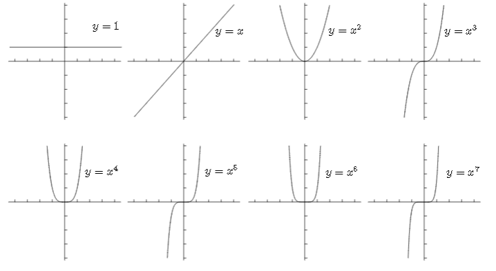
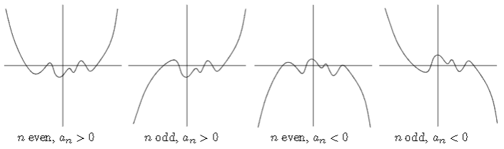

alias:: polynomial equation

- # 📝Definition
	- Polynomials are functions built on nonnegative integer powers of $x$.
- # ✒Notation
	- $$
	  \begin{align}
	  x^n
	  \end{align}
	  $$
	- The mathematical way to write a general polynomial of [degree](((d53fbaff-eec5-4d85-ab03-e911002c8e4c))) $n$ is
		- $$
		  p(x)=a_{n}x^{n}+a_{n-1}x^{n-1}+\cdots+a_{2}x^{2}+a_{1}x^{1}+a_{0}x^{0}.
		  $$
- # 📈Diagram
	- 📌Regular Polynomial Graph
		- {:height 400, :width 600}
	- 📌Four Possible Edges of polynomial
		- The edges matter only due to [degree](((d53fbaff-eec5-4d85-ab03-e911002c8e4c))) and [leading coefficient](((6337e478-0ae9-4e45-8483-d96d719d49ba))).
		- {:height 300, :width 500}
		- The wiggles in the center of these diagrams aren’t relevant—they depend on the other terms of the polynomial. The diagram is just supposed to show what the graphs look *like* near the left and right.
	-
- # ⛈Characteristics / Properties
	- 📌Degree
	  id:: d53fbaff-eec5-4d85-ab03-e911002c8e4c
		- The **highest** number $n$ such that $x^n$ has a **nonzero coefficient** is called the degree of polynomial.
	- 📌Leading coefficient
	  id:: 6337e478-0ae9-4e45-8483-d96d719d49ba
		- The coefficient of the highest-degree terms.
		- e.g. $5$ is the leading coefficient of the following equation.
			- $$
			  f(x)=5x^4-4x^3+10
			  $$