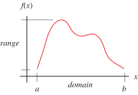
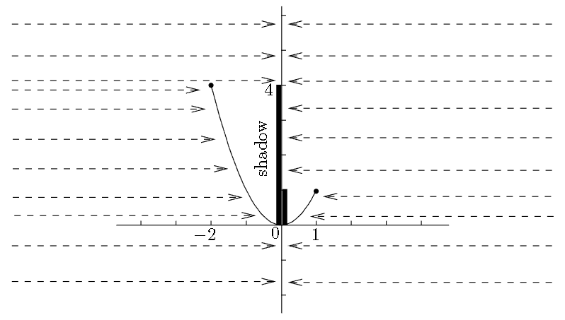

# 📝Definition
**📄Definition - range**
The outputs of a function come from a set called its range.

- A function that does use all the elements of the range is said to be **onto** the range. ^be8a9dcb429c6969
- The range is the set of **actual** outputs.

**📑Definition - image**
If $f:D\to Y$ is a map (a.k.a. function, transformation, etc.) over a [[domain]] $D$, then the image of $f$, also called the range of $D$ under $f$, is defined as the [[set]] of all values that $f$ can take as its argument varies over $D$, i.e.,
$$
\text{Range}(f)=f(D)=\{f(X):X \in D\}. 
$$

> [!info] Remark
> "Image" is a synonym for "range," but "**image**" is the term preferred in formal mathematical writing.

# 📈Diagram

# 🧠Intuition
The range is the union of both shadows from left and right.

# 🗃Example
Example is the most straightforward way to understand a mathematical concept.

# 🌱Related Elements
The closest pattern to current one, what are their differences?

# 🍂Unorganized