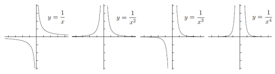

# 📝Definition
A quotient of two [[polynomial]]s $P(z)$ and $Q(z)$,
$$
R(z)\equiv\frac{P(z)}{Q(z)}
$$
is called a rational function, or sometimes a rational polynomial function.

# 📈Diagram

# 💫Operation
## Method of partial fractions
### 📝Definition
Given a rational function
$$
\frac{P(x)}{Q(x)}
$$
Such that:
- $Q(x)$ can be factored linearly with distinct factors
- the degree of $P(x)$  is less than the degree of $Q(x)$
The method is the following.
- 1️⃣Factor the denominator $Q(x)$
- 2️⃣Set-up the equation to something like this $$\frac{??}{A}+\frac{??}{B}$$
- 3️⃣Solve for $A$ and $B$
- 4️⃣Rewrite rational function.

### 🧠Intuition
The method of partial fraction is to transform a complicate rational function to a simplified form.

### 🗃Example
- 📂example of partial fraction 1
	- 💬Question:
		- To solve $$\frac{4x-1}{x^2+x-2}$$
	- ✏Solution:
		- 1️⃣Factor the denominator $Q(x)$
			- $$Q(x) = x^2+x-2 = (x-1)(x+2)$$
		- 2️⃣Set-up
			- $$\frac{4x-1}{(x-1)(x+2)} = \frac{A}{x-1}+\frac{B}{x+2}$$
		- 3️⃣Solve for $A$ and $B$
			- Solve A
				- Multiply by  $(x-1)$, then we have
				- $$\frac{4x-1}{x+2} = A + \frac{B}{x+2}(x-1)$$
				- Plug in $x=1$: (Take the limits as $x\to1$.)
				- $$\frac{4-1}{1+2} = A$$
			- Solve B
				- Multiply by $(x+2)$:
				- $$\frac{4x-1}{x-1} = \frac{A}{x-1}(x+2) +B$$
				- Plug in $x=-2$: (Take the limits as $x\to-2$.)
				- $$\frac{-8-1}{-2-1} = B$$
		- 4️⃣Rewrite rational function.
			- $$\frac{4x-1}{x^2+x-2} = \frac{1}{x-1}+\frac{3}{x+2}$$

## Repeated linear factors
### 📝Definition
This method builds on the method of partial fraction. Here is how it is defined. 
Given $\frac{P(x)}{Q(x)}$ such that $\mathrm{deg}P < \mathrm{deg}Q$. If $Q(x) = (x-a)^n$, then the set-up for partial fractions is as follows:
$$
\displaystyle \frac{P(x)}{Q(x)} = \frac{A_1}{(x-a)} + \frac{A_2}{(x-a)^2} + \frac{A_3}{(x-a)^3} + \dotsb + \frac{A_n}{(x-a)^n}.
$$

### 🗃Example
- 📂example of repeated linear factors 1
	- 💬Question: factor the following $$\displaystyle \frac{x^2}{x^3-x^2+x-1}$$
	- ✏Solution:
		- 1️⃣Factor denominator $\displaystyle \frac{P(x)}{Q(x)}$
			- $$\displaystyle \frac{x^2}{(x-1)(x^2+1)}$$
		- 2️⃣Setup
			- $$\displaystyle \frac{x^2}{(x-1)(x^2+1)} = \frac{A}{x-1} + \frac{Bx+C}{x^2+1}$$
		- 3️⃣ Solve for $A, B,$ and $C$.
			- Solve A
				- Cover-up $(x-1)$ to find $A$:
				- a.k.a. mutiply $(x-1)$ in both sides
				- then let $x=1$, we have
				- $$\displaystyle \frac{1}{1^1+1} = \frac12 = A$$
			- Solve $B,C$
				- Clean the denominator by multiply $(x-1)(x^2+1)$ in both sides
				- $$\begin{align}x^2 &= (1/2)(x^2+1) + (Bx+C)(x-1)\\ &= (1/2 + B)x^2 + (C-B)x+(1/2-C)\end{align}$$
				- let's focus on the coefficient from both sides. Then we could write like this format. $??x^2+??x+??\text{constant}$
				- $$1\cdot x^2+0\cdot x+ 0= (1/2 + B)x^2 + (C-B)x+(1/2-C)$$
				- Then we have the following in light of coefficients
				- $$\begin{align}1 = 1/2 + B \quad \Longrightarrow \quad B = 1/2\\0 = 1/2 - C \quad \Longrightarrow \quad C = 1/2\end{align}$$
		- 4️⃣Rewrite rational function.
			- $$\frac{1/2}{x-1} + \frac{(1/2)x+1/2}{x^2+1}$$

## Improper fractions
### 📝Definition
The technique also builds on the method of partial fractions. Here is how it goes:
To integrate a rational function $\displaystyle \frac{P(x)}{Q(x)}$ such that $\mathrm{deg}P \geq \mathrm{deg}Q$:
- 1️⃣Use [[long division]] to divide $Q(x)$ into $P(x)$ to obtain
	- $$\displaystyle \frac{P(x)}{Q(x)} = p(x) + \frac{r(x)}{Q(x)}$$
	- where $p(x)$ and $r(x)$ are polynomials, and $\mathrm{deg}r < \mathrm{deg}Q$.
- 2️⃣Use the method of partial fractions to divide $\displaystyle \frac{r(x)}{Q(x)}$ into simpler pieces to integrate.
### 🗃Example
- 📂improper fractions example 1
	- 💬Question: Use [[long division]] on $\displaystyle \frac{x^8}{(x+2)^2(x-2)^2}$ to find the quotient $q(x)$ and remainder $r(x)$ such that $$\displaystyle \frac{x^8}{(x+2)^2(x-2)^2} = q(x) + \frac{r(x)}{(x+2)^2(x-2)^2}.$$
	- 🏹Strategy: xxx
	- ✏Solution: xxx

# 🕹Quiz
- 📌Quiz 1
	- 💬Question: Which of the following functions are rational functions?
		- $0,x, x^{-1}, x^{2/3}, \frac{x^2-1}{x^2+1}, \frac{x^2-1}{\sqrt{x^2+1}}, e^x+1$
	- ✏Solution:
		- $0$✅
			- The constant function $0$ is a polynomial, so it is also a rational function.
		- $x$✅
			- The linear function $x$ is a polynomial, so it is also a rational function where the denominator is $1$.
		- $x^{-1}$✅
			- The function $x^{-1} = \frac{1}{x}$ is a rational function.
		- $x^{2/3}$❌
			- The function $x^{2/3}$ is not rational because it is raised to a **non-integer** power.
		- $\frac{x^2-1}{\sqrt{x^2+1}}$❌
			- The denominator of $\frac{x^2-1}{\sqrt{x^2+1}}$ is not a polynomial, so this is not a rational function.
		- $e^x+1$
			- The function $e^x+1$ is not polynomial, so is not rational.

