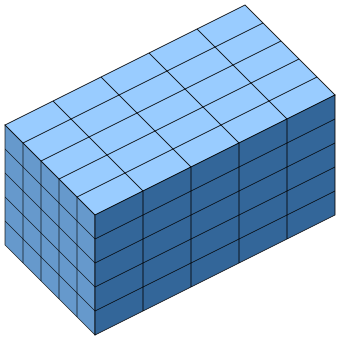

# 📝Definition
A regular grid is a [[tessellation]] of $n$-dimensional Euclidean space by congruent parallelotopes (e.g. bricks).

Each cell in the grid can be addressed by index:
- $(i, j)$ in 2-dimensions 
- $(i, j, k)$ in 3-dimensions
and each vertex has coordinates
- $(i\cdot dx,j\cdot dy)$ in 2D
- $(i\cdot dx,j\cdot dy,k\cdot dz)$ in 3D
for some real numbers $dx$, $dy$, and $dz$ representing the grid spacing.

# 🧀Applicability
Grids of this type may be used in [[finite element analysis]], finite volume methods, finite difference methods, and in general for discretization of parameter spaces.

## 🍞Discretize [[implicit surface representation|implicit surface]]
**📝Description**
On the computer, it is straightforward to [[discretization|discretize]] an implicit function, the continuous scalar field $F$ is typically **discretized** in some [[bounding box]] around the object using a sufficiently dense grid with nodes $g_{ijk}\in\mathbb{R}^3$.

The most basic representation, therefore, is a uniform scalar grid of sampled values $F_{ijk} := F(g_{ijk})$, and function values within voxels are derived by [[trilinear interpolation]], thus providing quadratic approximation order. 

**🗃Example**
See the example of ![[trilinear interpolation#^aa573d]]
**⛈Characteristics**
- This method is uniform. a.k.a. treat every space equally.
- the complexity($O$) is cubic!

**🩹Cons**
However, the memory consumption of this naive data structure **grows cubically** if the precision is increased by reducing the edge length of grid voxels.

**🌱Related Elements**
An implicit surface stored as the level-set of a trilinearly interpolated grid can be _contoured_ into a triangle mesh via the [[Marching Cubes Algorithm]]. 

# 🍂Unorganized