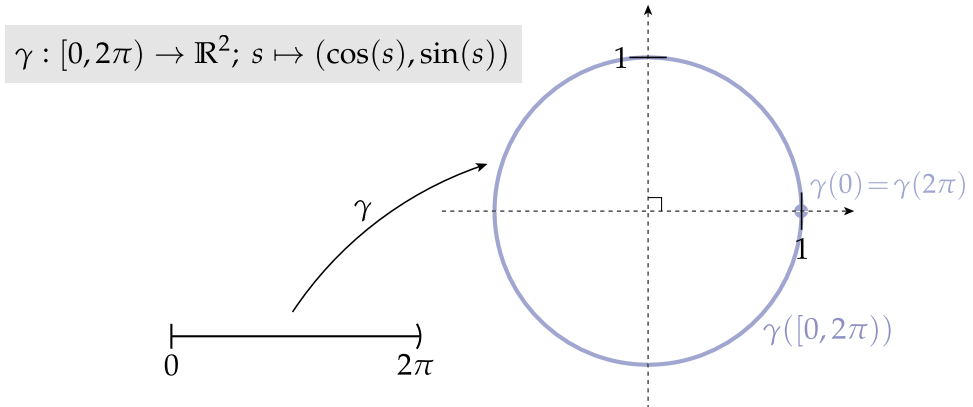

# 📝Definition
**📄Definition - smooth curve**
A smooth curve is a [[curve]] which is a smooth function, where the word "curve" is interpreted in the #AnalyticGeometry  context. In particular, a smooth curve is a [[continuity|continuous]] [[function|mapping]] $f$ from a $1$-dimensional space to an $n$-dimensional space which on its [[domain]] has continuous [[derivative]]s up to a desired order.
___
**📃Definition - differentiable curve**
A parametrized differentiable curve is a [[differentiable]] [[Function|map]] $\alpha: I \to \mathbb{R}^3$ of an open [[interval]] $I = (a, b)$ of the real line $\mathbb{R}$ into $\mathbb{R}^3$.

> [!info] Remark
> When discussing curves from the standpoint of analytic geometry, care must be exhibited to maintain the important distinction between the curve itself and its [[range|image]] within its [[codomain]].
> 
> 
> For example, the curves $\gamma_i:[0,1]\to\mathbb{R}, i=1,2$, defined, respectively, by
> $\gamma_1(t)=t$ and $\gamma_2(t)=t$.
> These 2 are unique as curves even though both functions have the [[interval]] $[0,1]$ as their image in $\mathbb{R}$. This distinction is especially important due the fact that unique curves may possess drastically different geometric behavior in terms of self-intersection, etc., despite having identical images.

# 📈Diagram

# 🧠Intuition
Find an intuitive way of understanding this concept.

# 🗃Example
Example is the most straightforward way to understand a mathematical concept.

# 🌱Related Elements
The closest pattern to current one, what are their differences?

# 🍂Unorganized