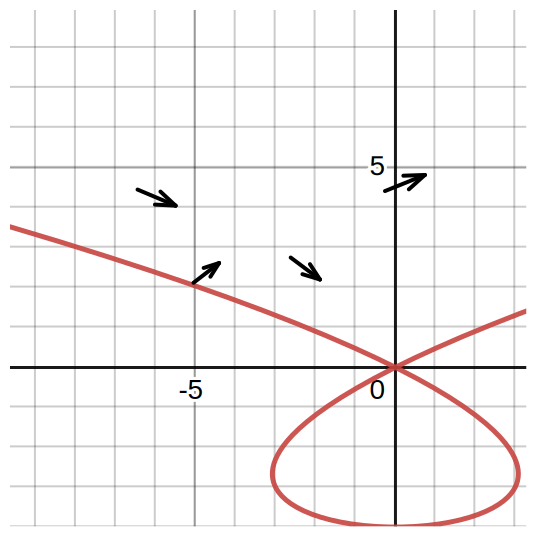
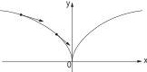

# 📝Definition
**📄Definition - smooth curve**
A smooth curve is a [[curve]] which is a smooth function, where the word "curve" is interpreted in the #AnalyticGeometry  context. In particular, a smooth curve is a [[continuity|continuous]] [[function|mapping]] $f$ from a $1$-dimensional space to an $n$-dimensional space which on its [[domain]] has continuous [[derivative]]s up to a desired order.
___
**📃Definition - differentiable curve**
A parametrized differentiable curve is a [[differentiable]] [[function|map]] $\alpha: I \to \mathbb{R}^3$ of an open [[interval]] $I = (a, b)$ of the real line $\mathbb{R}$ into $\mathbb{R}^3$.

> [!info] Remark
> When discussing curves from the standpoint of analytic geometry, care must be exhibited to maintain the important distinction between the curve itself and its [[range|image]] within its [[codomain]].
> 
> 
> For example, the curves $\gamma_i:[0,1]\to\mathbb{R}, i=1,2$, defined, respectively, by
> $\gamma_1(t)=t$ and $\gamma_2(t)=t$.
> These 2 are unique as curves even though both functions have the [[interval]] $[0,1]$ as their image in $\mathbb{R}$. This distinction is especially important due the fact that unique curves may possess drastically different geometric behavior in terms of self-intersection, etc., despite having identical images.
> 
> See example [[smooth curve#^c20ba3]]

# 📈Diagram

# 🧠Intuition
Find an intuitive way of understanding this concept.

# 🌈Properties
## 🔴differentiable
### 📝Description
The word differentiable in the definition means that $\alpha$ is a correspondence which maps each $t \in I$ into a point $\alpha(t) = (x(t ), y(t ), z(t)) \in \mathbb{R}^3$ in such a way that the functions $x(t ), y(t ), z(t)$ are differentiable.

> [!info] Remark
> The $\alpha(t)$ here is a [[vector-valued function]]. Usually, $\alpha(t)$ can also be seen as a [[position vector]] since the output is a vector in $\mathbb{R}^3$.

## 🟠parameter
### 📝Definition
The $t$ of $\alpha(t)$ is the ==parameter== of the curve.

## 🟡1st derivative
### 📝Description
If we denote by $x'(t)$ the first [[derivative]] of $x$ at the point $t$ and use similar notations for the functions $y$ and $z$, the vector $(x'(t ), y'(t ), z'(t)) = \alpha'(t) \in \mathbb{R}^3$ is called the [[tangent vector]] (or [[velocity vector]]) of the curve $\alpha$ at $t$ .

> [!info] Remark
> The difference between tangent vector and velocity vector is their semantics.
> - tangent vector orients to the "geometry" sense.
> - velocity vector orients to the "physics" sense.

## 🟢trace
### 📝Definition
The [[range|image]] set $\alpha(I ) \subset \mathbb{R}^3$ is called the ==trace== of the curve $\alpha$.
> [!info] Remark
> We should carefully distinguish a parametrized curve itself and its trace. They look the same but it is different!
> - parametrized curve: it is a map.
> - trace: it is a subset of $\mathbb{R}^3$.
> See the example for clarification. [[smooth curve#^c20ba3]]

## 🔵arc length
The arc length of a curve see [[arc length]].

🟣

# ⛈Characteristics
## ☁regular
### 📝Definition
A parametrized differentiable curve $\alpha: I \to \mathbb{R}^3$ is said to be ==regular== if $\alpha'(t) \neq 0$ for all $t \in I$.

### 🧠Intuition
A regular curve does not have any [[singularity|singular point]].

## 🌧change of orientation
### 📝Description
Given the curve $\alpha$ parametrized by [[arc length]] $s \in (a, b)$, we may consider the curve $\beta$ defined in $(−b,−a)$ by $\beta(−s) = \alpha(s)$, which has the same [[smooth curve#🌈Properties#🟢trace|trace]] as the first one but is described in the opposite direction. We say, then, that these two curves differ by a *change of orientation*.

## 🌨injective not required
### 📝Description
The differentiable curve $\alpha$ is not required to [[injective function|injective]].

### 🧠Intuition
It simply means a curve can be self-intersect.

### 🗃Example
Suppose a curve $\alpha(t)=(t^3-4t, t^2-4)$. Take $t_{1,2}=\pm2$, then $\alpha(t_1)=\alpha(t_2)=(0,0)$.

> [!info] Remark
> The curve has direction. Suppose $t\in\{-\infty, \infty\}$.
> - when $t$ goes from $-\infty\to0$, $x=t^3-4t$ is negative, $y=t^2-4$ is positive. Therefore the curve goes from the 2nd [[quadrant]].
> - when $t$ goes from $0\to\infty$, $x=t^3-4t$ is positive, $y=t^2-4$ is positive. Therefore the curve goes towards the 1st [[quadrant]].

🌩
⛅
🌤
🌪
🌥
🌦

# 🗃Example
- 📁 helix
	- A [[helix]] is a differentiable curve.

- 📩 not a differentiable curve example ^665e91
	- The map $\alpha:\mathbb{R}\to \mathbb{R}^2$ given by $\alpha(t) = (t, |t|), t \in\mathbb{R}$, is not a parametrized differentiable curve, since $|t|$ is not differentiable at $t = 0$.
	- See the graph. 
		- 
		- Hint. There is a [[singularity|singular point]] at $t=0$ called [[cusp]].

- 🗂
- 📨
- 📂

- 📁smooth curve example ^c20ba3
	- 💬Question: What is the difference of the two distinct parametrized curves
		- $$\begin{align}\alpha(t)&=(\cos t,\sin t),\\\beta(t)&=(\cos 2t,\sin 2t)\end{align}$$ where $t\in(0-\epsilon, 2\pi+\epsilon), \epsilon>0$?
	- 🗣Answer:
		- They have the same trace which is a circle $x^2+y^2=1$.
		- But the velocity vector of the second curve is the double of the first one.
		- Their ==parameter== is different!
		- See the 1st derivative of a same point has different length.
			- 

# 🏷Categories
## 🔖special kind of curve
### 📝Description
It can happen that the parameter $t$ is already the [[arc length]] measured from some point. In this case, $ds/dt = 1 = |\alpha'(t)|$. That is, the [[velocity vector]] has constant length equal to 1.

Conversely, if $|\alpha'(t)|\equiv1$, then
$$
s=\int_{t_0}^tdt=t-t_0
$$
i.e., the $t$ is the arc length of $\alpha$ measured from some point.

#TODO I feel like this curve is special and maybe defined? I am not sure.

# 🌱Related Elements
The closest pattern to current one, what are their differences?

# 🍂Unorganized