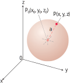
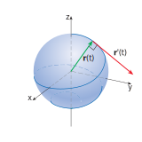

# 📝Definition

> [!info] Remark
> Spheres are special cases of [[ellipsoid]]s.

# ✒Notation
A sphere with center at $P_0(x_0,y_0,z_0)$ and with radius $a$ can be expressed as:
$$
\begin{align}
(x-x_0)^2+(y-y_0)^2+(z-z_0)^2=a^2.
\end{align}
$$
> [!info] Remark
> Distance between a point $P(x,y,z)$ lies on the sphere and $P_0$ is exactly $|P_0 P|=a$.

# 🧠Intuition
Find an intuitive way of understanding this concept.

# 🗃Example

# 🌱Related Elements
🥭
🍎
🍏
🍅
## 🍇sphere as vector-valued function
**📋Prerequisite**
Understand this topic requires.
- [[angle between vectors]]
- [[orthogonal vectors]]
- [[vector-valued function]]

Treat sphere as [[vector-valued function]] of constant length.
**📝Description**
When we track a particle moving on a sphere centered at the origin, the [[position vector]] has a constant length equal to the radius of the sphere. The [[velocity vector]] $d\mathbf{r}/dt$, [[tangent line|tangent]] to the path of motion, is tangent to the sphere and hence perpendicular to $\mathbf{r}$.

**📏Proof**
$$
\begin{align}
\mathbf{r}(t)\cdot \mathbf{r}(t)&=c^2\quad\quad\lVert\mathbf{r}(t)\rVert=c \text{ is constant.}\\
\frac{d}{dt}[\mathbf{r}(t)\cdot \mathbf{r}(t)]&=0\quad\quad\text{differentiate both sides}\\
\mathbf{r}'(t)\cdot \mathbf{r}(t)+\mathbf{r}(t)\cdot \mathbf{r}'(t)&=0\\
2\mathbf{r}'(t)\mathbf{r}(t)&=0\\
\mathbf{r}'(t)\mathbf{r}(t)&=0
\end{align}
$$
**⚖Theorem**
Then we can have 2 equivalent theorems.
If $\mathbf{r}$ is a [[differentiable]] vector function of $t$ of constant length, then
$$
\begin{align}
\mathbf{r}'(t)\mathbf{r}(t)&=0\\\text{or}\\\mathbf{r}\cdot\frac{d\mathbf{r}}{dt}&=0
\end{align}
$$

If $\lVert \mathbf{r}(t) \rVert=c$ (a constant), then $\mathbf{r}'(t)$ is [[orthogonal vectors|orthogonal]] to $\mathbf{r}(t)$ for all $t$.

🍈
🍉
🍊
🍌
🍍
🍑
🍒
🍓
🥑
🥝
🍋
🍐

# 🍂Unorganized