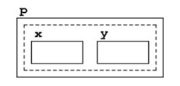

- ## 🧠Intuition
	- The fundamental characteristic of a structure is that it is possible to view it both as a collection of individual fields and as a single value.
	  
	  ``` c++
	  struct Point
	  {
	      int x;
	      int y;
	  };
	  ```
	  