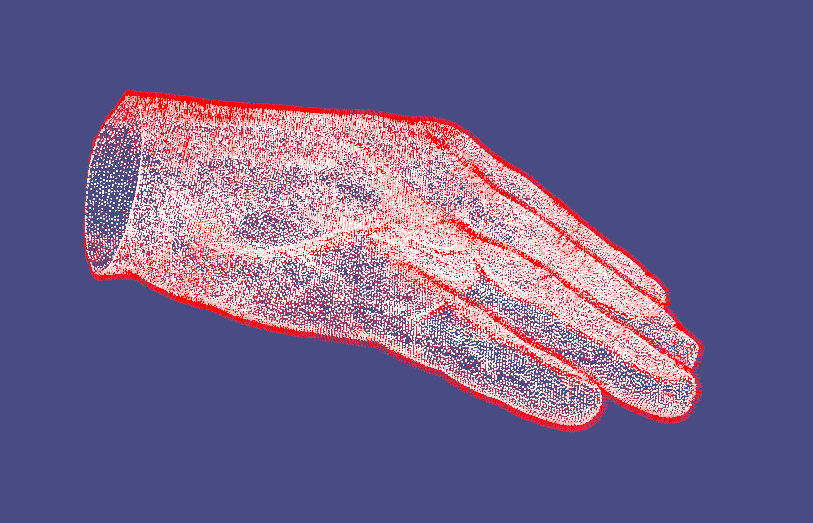
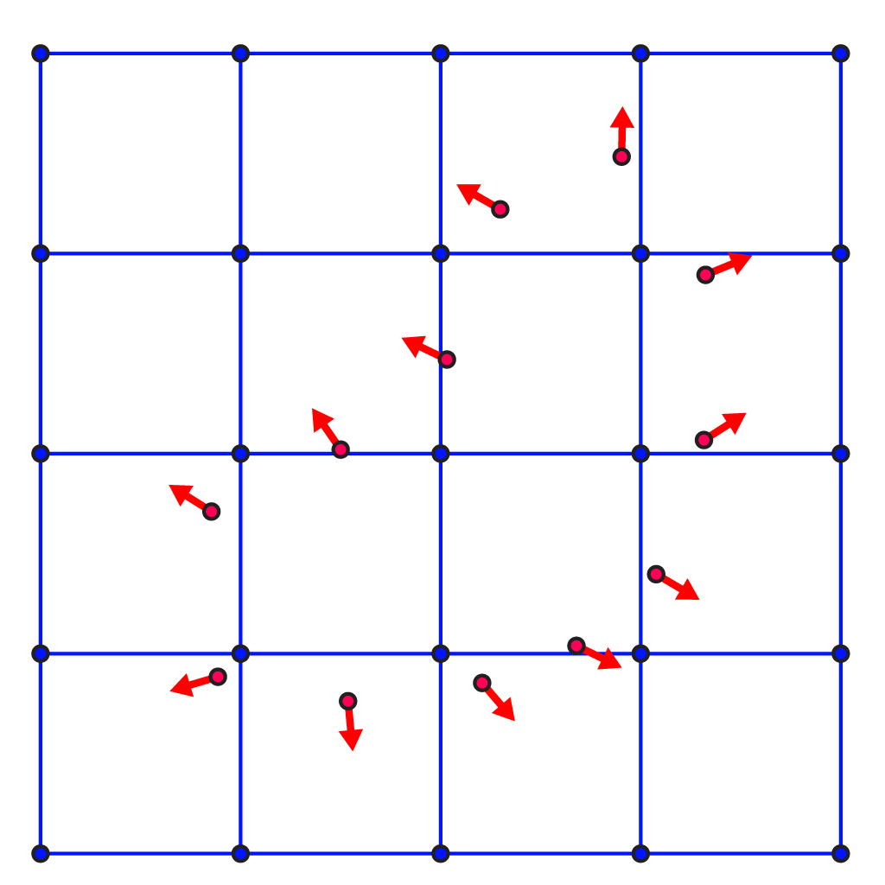
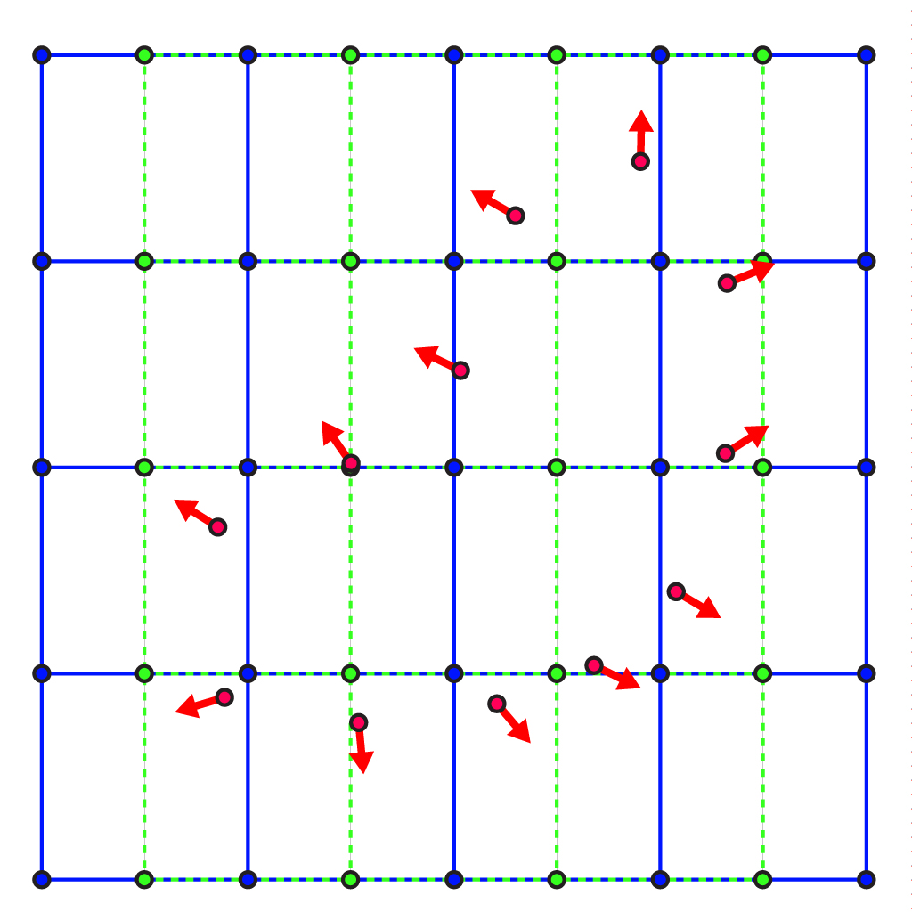
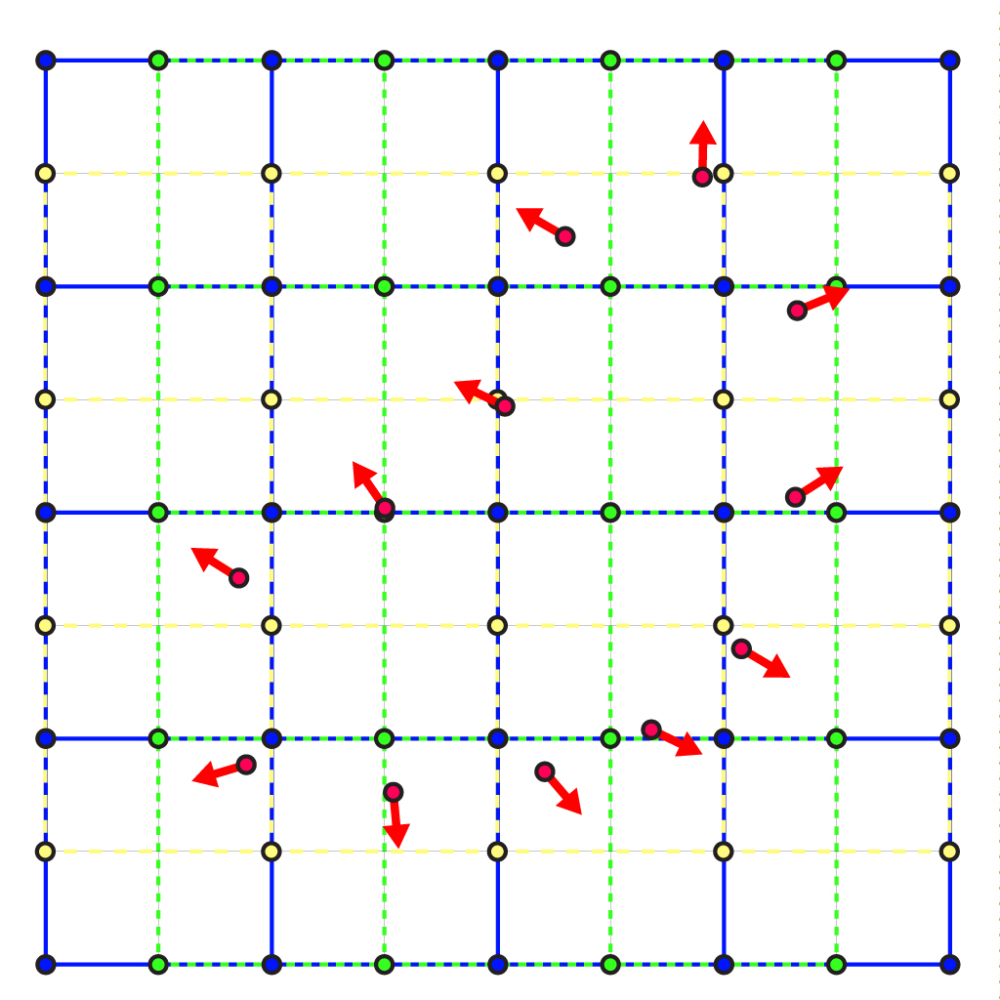

# 📝Definition

# 🧠Intuition
Find an intuitive way of understanding this concept.

# 🗃Example
Example is the most straightforward way to understand a mathematical concept.

# 🐍Algorithm
## 🐊Poisson Surface Reconstruction
This is the algorithm defined in [[📄Poisson Surface Reconstruction]].

**📝Definition**
This method states that the [[indicator function]], a function that determines which points in space belong to the surface of the shape, can actually be computed from the sampled points.

**🧠Intuition**
The key concept is that [[gradient]] of the indicator function
- $=0$, where it is *==not at== the sampled points*
- $=$ the inward surface normal, where it is *==at== the sampled points*.

**✒Notation**
More formally, suppose the collection of sampled points from the surface is denoted by $S$, each point in the space by $p_{i}$, and the corresponding normal at that point by $n_{i}$.

Then the gradient of the indicator function is defined as
$$
\triangledown g={\begin{cases}{\textbf {n}}_{i},&\forall p_{i}\in S\\0,&{\text{otherwise}}\end{cases}}
$$

**🏹Strategy**
> [!tip] tips
> The task of reconstruction then becomes a [[calculus of variations|variational problem]].

Here is a hint, since the gradient of the indicator function is $0$ when that is NOT the surface. Therefore, this is an optimization problem!! Find the function and optimize it until its gradient reaches $0$!!

To find the indicator function $\chi$ of the surface
- 1️⃣ the function $\chi$ must minimize $\lVert \triangledown \chi -{\textbf {V}}\rVert$
	-  $\textbf {V}$ is the [[vector field]] defined by the samples.
- 2️⃣ View the minimizer $\chi$ as a solution of [[Poisson's equation]] since it is a variational problem.
- 3️⃣ Have a good approximation of $\chi$ and $\sigma$ 
	- $(x,y,z)$ denotes the points
	- $\chi (x,y,z)=\sigma$ denotes the surface to be reconstructed
- 4️⃣ Use the [[Marching Cubes Algorithm]] to construct a [[triangle mesh]] from the function $\chi$

> [!info]
> Sometimes the indicator refers to infinitesimally [[mollifier]] (smoothed) indicator function.

**✏Solution**
- Let's start with 2 assumptions:
	- 1️⃣ we know how to compute the $\nabla g$ at each node location $\mathbf{x}_{i,j,k}$ on the regular grid.
	- 2️⃣ the sample points $\mathbf{P}$ all lie at grid nodes. meaning:
		- $\exists \mathbf{x}_{i,j,k} = \mathbf{p}_{\ell}$
- However, these assumptions are not realistics and we have to "relax" a bit.
- We make another logical induction.
	- If our points $\mathbf{P}$ lie at grid points, then our corresponding normals $\mathbf{N}$ also live at grid points.
- By introducing the vector, we now have ==3== objects.
	- 1️⃣the gradient of function $g$
	- 2️⃣the surface normal
	- 3️⃣zero gradient away from the surface
- We link the preceding 3 objects in equations.
	- $$\nabla g(\mathbf{x}_{i,j,k})=\mathbf{v}_{i,j,k}:=\begin{cases}\mathbf{n}_{\ell}\quad&\text{if }\exists\mathbf{p}_{\ell}=\mathbf{x}_{i,j,k}\\\begin{pmatrix}0\\0\\0\end{pmatrix}\quad&\text{otherwises.}\end{cases}$$
	- > [!tip]
	   > This is a [[vector-valued function]].
	    > The gradients, normals, and zero-vectors are 3-dimensional. (e.g. $\nabla g\in\mathbb{R}^3$)
- From here, we try to recall our objective from the beginning.
	- Our objective: the value of $g$ for each grid node.
	- Right now: 3 equations for each grid node
- Therefore, the preceding equations are over determined.
- Hence, we turn this problem into optimization which minizes the error of the equation:
	- $$\lVert\nabla g(\mathbf{x}_{i,j,k})-\mathbf{v}_{i,j,k}\rVert^2$$
	- this is the error for ==1== grid node
- We will treat the error of each grid location equally by minimizing the sum over all grid locations.
	- $$\min_{g}\sum_i\sum_j\sum_k\frac{1}{2}\lVert\nabla g(\mathbf{x}_{i,j,k})-\mathbf{v}_{i,j,k}\rVert^2$$
	- 。。
- Since we are working on [[regular grid]] and we can take advantage from that:
	- > [!tip]
	  > [[finite difference method]] is a good fit to approximate the gradient $\nabla g$ on the grid.
- Now the relevant stuffs are all set. Then we turn to $g$.
	- > [!question]
	  > What is $g$ exactly? How we can compute it?
	- We can compute the approximation of the $x,y,z$ components of $\nabla g$ via a [[Sparse Matrix]] multiplication of a "gradient matrix" $\mathbf{G}$ and our unknown grid values $\mathbf{g}$.
- The minimization problem now turns to
	- $$\min_{g}\frac{1}{2}\lVert\mathbf{Gg}-\mathbf{v}\rVert^2$$
	- or equivalently expanding to $$\min_{g}\frac{1}{2}\mathbf{g}^T\mathbf{G}^T\mathbf{Gg}-\mathbf{g}^T\mathbf{G}^T\mathbf{v}+\text{constant}$$
- This is a quadratic "energy" function of variables of $\mathbf{g}$, its minimum occurs when an infinitesmal change in $\mathbf{g}$ produces no change in the energy.
	- $$\frac{\partial}{\partial g}\frac{1}{2}\mathbf{g}^T\mathbf{G}^T\mathbf{Gg}-\mathbf{g}^T\mathbf{G}^T\mathbf{v}=0$$
- Applying this derivative gives us a sparse system of linear equations:
	- $$\mathbf{G}^T\mathbf{Gg}=\mathbf{G}^T\mathbf{v}$$
- We can solve this by sparse solver.

- Now, let's revisit the assumptions.
- The [[gradient]] of a function $f$ in 3D is just a vector containing [[partial derivative]] in each coordinate direction:
	- $${\nabla}g(\mathbf{x}) = \begin{pmatrix}\frac{\partial g(\mathbf{x})}{\partial x}\\\frac{\partial g(\mathbf{x})}{\partial y} \\\frac{\partial g(\mathbf{x})}{\partial z}\end{pmatrix}.$$
- We will approximate each partial derivative individually. Now let's take $x$ direction as example.
	- $\partial g(\mathbf{x})/\partial x$
	- The partial derivative in $x$ direction is 1-dimensional derivative.
	- We write down the formula first.
		- $$\frac{\partial g(\mathbf{x}_{i-\frac12 ,j,k})}{\partial x} = \frac{g_{i,j,k} - g_{i-1,j,k}}{h},$$
	- From 3 aspects to understand this.
		- 1️⃣ We recall the [[derivative#🧠Intuition|essence of derivative]] - "instantaneous rate of change".
		- 2️⃣ $h$ - refers to the spatial distance between adjacent nodes ( #thingsIDK  is it because we are in regular grid )
		- 3️⃣ $g_{i,j,k} - g_{i-1,j,k}$ - refers to the difference between the function evaluated at "one grid node" and at "the grid node _before_ it" in the $x$-direction.
	- Why there is a $\frac{1}{2}$?
		- Let me put a diagram here.
			- 
			- 🔵Blut dots: they are the grid node, a.k.a. the $g$
		- Think about the rate of change. $\frac{f(x+a)-f(x)}{\Delta x}$
			- $f$ - the blue node is the value
			- $f(x+a)-f(x)$ the difference of the value is measured by the former one and the latter one.
			- $\Delta x$ - the grid size.
		- Therefore, we can map the change on $x$ direction like this.
			- 
- The change on $y$ direction is pretty much similar.
	- 
- Now let's construct the matrix! ( #TODO a better title of this step )
	- How many grid nodes we have?
		- That is $n_x\cdot n_y\cdot n_z$
	- We construct a [[column vector]] of function values on the primary grid. (a.k.a. the blue dots on the grid)
		- $$\mathbf{g}\in\mathbf{R}^{n_x\cdot n_y\cdot n_z\times1}$$
		- numbers of row: $n_x\cdot n_y\cdot n_z$
		- numbers of colums: 1
	- A [[Sparse Matrix]] then can be constructed like so.
		- $$\mathbf{D}\in\mathbf{R}^{(n_x-1)n_y n_z \times n_x n_y n_z}$$
		- numbers of row: $(n_x-1)n_y n_z$. #thingsIDK Why $n_x-1$?
		- numbers of colums: $n_x n_y n_z$
	- Let's interpret the matrix.
		- the computation of each row.
			- each row $\mathbf{D}^x_{i-\frac12 ,j,k} \in \mathbf{R}^{1 \times n_x n_y n_z}$ computes the partial derivative at the corresponding staggered grid location $\mathbf{x}_{i-\frac{1}{2} ,j,k}$
			- #thingsIDK what is the superscript $x$ in $\mathbf{D}$? is the $\mathbf{R}$ now transpose?
		- the value of the $\ell$th entry in that row
			- the $\ell$th entry in that row receives a value only for neighboring primary grid node
			- $$\mathbf{D}^x_{i-\frac12 ,j,k}(\ell)=\begin{cases}-1 & \text{ if $\ell = i-1$ }\\1 & \text{ if $\ell = i$ }\\0 & \text{ otherwise}\end{cases}.$$
			- #thingsIDK in general I don't get it.
- Let's think of it in computer data structure!
	- The data structure can't do.
		- ❌index the [[column vector]] $\mathbf{g}$ by $\{i,j,k\}$ 
		- ❌index the rows of $\mathbf{D}$ by $\{i-\frac12 ,j,k\}$
	- The workaround - flat them into 1 dimension.
		- ✅ $\mathbf{g}_{i,j,k}$ can now refer to `g(i + j*n_x + k*n_y*n_x)`
		- ✅ $\mathbf{D}^x_{i-\frac12 ,j,k}(\ell)$ can now refer to `Dx(i + j*n_x + k*n_y*n_x , l)`
			- where $i-\frac12$ has been rounded.
- Similarly, we can build $\mathbf{D}^y$ and $\mathbf{D}^z$
	- The strategy is to stack them into a huge gradient matrix $\mathbf{G}$.
	- $$\mathbf{v} = \begin{pmatrix} \mathbf{v}^x \\ \mathbf{v}^y \\ \mathbf{v}^z \end{pmatrix} \in \mathbf{R}^{ \left((n_x-1)n_yn_z + n_x(n_y-1)n_z + n_xn_y(n_z-1)\right)\times 1}$$
- What if the input normals might not exactly be hit at grid node locations?🤔
	- For example, the input normals are red dots🔴 and they are overlapped with the blue dots🔵(our grid node).
		- 
	- To remedy this, we will distribute each component of each input normal $\mathbf{n}_\ell$ to $\mathbf{v}$ at the corresponding staggered grid node location.
		- Suppose the normal $\mathbf{n}$ at some point $\mathbf{x}_{1,\frac14 ,\frac12 }$.
		- Imagine the $x$-component of the normal $n_x$ as **floating** in the staggered grid corresponding to $\mathbf{D}^x$.
		- Then the ==8== points would be:
			- $$\mathbf{x}_{\frac12 ,0,0},\quad \mathbf{x}_{1\frac12 ,0,0},\quad \mathbf{x}_{\frac12 ,1,0},\quad \mathbf{x}_{1\frac12 ,1,0},\quad \mathbf{x}_{\frac12 ,0,1},\quad \mathbf{x}_{1\frac12 ,0,1},\quad \mathbf{x}_{\frac12 ,1,1},\quad \mathbf{x}_{1\frac12 ,1,1} $$
			- #TODO a diagram for this.
			- #thingsIDK What is the first $1$ in $\mathbf{x}_{1\frac12 ,0,0}$? I don't think it is a typo. I assume it is short for $1+\frac{1}{2}$ meaning half grid size forward. 可以一起看，一又二分之一. And the $\frac{1}{2}$ is short for $1-\frac{1}{2}$ meaning half grid size backward.
	- Then we should think about how to compute them.
		- The fact we know is: these staggered grid nodes has a corresponding $x$ value in the vector $\mathbf{v}^x$.
		- We can "==distribute==" $n_x$ to these entries in $\mathbf{v}^x$ by adding a ==portion== amount of $n_x$ to each.
			- $$\begin{align}v^x_{\frac12 ,0,0}  &= w_{ \frac12 ,0,0}\left(\mathbf{x}_{1,\frac14 ,\frac12 }\right)\ n_x,  \\ v^x_{1\frac12 ,0,0} &= w_{1\frac12 ,0,0}\left(\mathbf{x}_{1,\frac14 ,\frac12 }\right)\ n_x,  \\ &\vdots \\ v^x_{1\frac12 ,1,1} &= w_{1\frac12 ,1,1}\left(\mathbf{x}_{1,\frac14 ,\frac12 }\right)\ n_x. \end{align} $$
			- #thingsIDK What is the first subscript of $v^x_{1\frac12 ,1,1}$? what is the first $1$? Probably the same with the preceding.
			- $w_{i+\frac12 ,j,k}(\mathbf{p})$ is the [[trilinear interpolation]] weight associate with staggered grid node $\mathbf{x}_{iِ+\frac12 ,j,k}$ to interpolate a value at the point $\mathbf{P}$.
			- Here is how it is computed.
				- $$\begin{align}n_x =& \\ &w_{ \frac12 ,0,0}( \mathbf{x}_{1,\frac14 ,\frac12 } ) \  v^x_{ \frac12 ,0,0} +  \\ &w_{1\frac12 ,0,0}( \mathbf{x}_{1,\frac14 ,\frac12 } ) \  v^x_{1\frac12 ,0,0} +  \\ &\vdots \\ &w_{1\frac12 ,1,1}( \mathbf{x}_{1,\frac14 ,\frac12 } ) \ v^x_{1\frac12 ,1,1}. \end{align}$$
				- #thingsIDK not sure about the preceding
		-  #thingsIDK  Since we need to do these for the $x$-component of each input normal, we will assemble a sparse matrix $\mathbf{W}^x \in n \times (n_x-1)n_yn_z$ that _interpolates_ $\mathbf{v}^x$ at each point $\mathbf{p}$:
			- $$( \mathbf{W}^x \mathbf{v}^x ) \in  \mathbf{R}^{n\times 1}$$
			- Note on the inverse.
				- the transpose of $\mathbf{W}^x$ is not quite its [[matrix#💫Support Operation#📌Matrix Inverse|inverse]], but instead can be interpreted as distributing values onto the staggered grid locations where $\mathbf{v}^x$ lives.
				- $$\mathbf{v}^x = (\mathbf{W}^x)^{\mathsf T} \mathbf{N}^x.$$
		-  #thingsIDK Using the definition of $\mathbf{v}^x$ and analogously for $\mathbf{v}^y$ and $\mathbf{v}^z$ we can construct the vector $\mathbf{v}$ in our energy minimization problem above.
- Now we go back and think what is Poisson got to do with this?
	- The discrete energy minimization problem we've written looks like the squared norm of some gradients. An analogous energy in the smooth world is the [[Dirichlet energy]].
	- $$E(g) = \int _{\Omega} \| {\nabla}g\| ^2  dA$$
	- It 

# 🌱Related Elements
The closest pattern to current one, what are their differences?

# 🍂Unorganized

