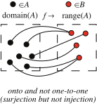

https://mathworld.wolfram.com/Surjection.html
# 📝Definition
Let $f$ be a [[function]] defined on a [[set]] $A$ and taking values in a set $B$. Then $f$ is said to be a surjection (or surjective map) if, for any $b$ in $B$, there exists an $a$ in $A$ for which $b=f(a)$.

> [!info] Remark
> A surjection is sometimes referred to as being "onto."

# 🌓Complement
[[injective function]]

# 🧠Intuition
Find an intuitive way of understanding this concept.

# 🗃Example
Example is the most straightforward way to understand a mathematical concept.

# 🌱Related Elements
The closest pattern to current one, what are their differences?

# 🍂Unorganized