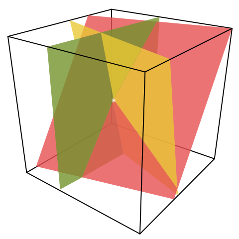

https://en.wikipedia.org/wiki/System_of_linear_equations

# 📝Definition
A linear system of equations is a [[set]] of $n$ [[linear equation]]s in $k$ variables (sometimes called "**unknowns**"). Linear systems can be represented in [[matrix]] form as the matrix equation
$$
Ax=b
$$
where
- $A$ - the matrix coefficients
- $x$ - the [[column vector]] of variables
- $b$ - the column vector of solutions.
	- $b$ is the result of [[linear combination]] of $Ax$.
	- the [[column space]] of  $b$ is in the column space of $A$.

> [!note]
> A **classic** and **common** linear system is a system with 3 variables determines a collection of planes. The intersection point is the ==solution==.
> 

# 🧠Intuition
The word "**==system==**" indicates that the equations are to be considered collectively, rather than individually.

# ✒Notation
## 🖋General Notation
A system of $m$ linear equations with $n$ unknowns and coefficients can be written as
$$
{\displaystyle {\begin{cases}a_{11}x_{1}+a_{12}x_{2}+\dots +a_{1n}x_{n}+b_{1}=0\\a_{21}x_{1}+a_{22}x_{2}+\dots +a_{2n}x_{n}+b_{2}=0\\\vdots \\a_{m1}x_{1}+a_{m2}x_{2}+\dots +a_{mn}x_{n}+b_{m}=0,\end{cases}}}
$$
where
- ${\displaystyle x_{1},x_{2},\dots ,x_{n}}$ are the unknowns.
- ${\displaystyle a_{11},a_{12},\dots ,a_{mn}}{\displaystyle a_{11},a_{12},\dots ,a_{mn}}$ are the coefficients of the system,
	- such that ${\displaystyle a_{11}+a_{12}+\dots +a_{mn}\neq 0}$
- ${\displaystyle b_{1},b_{2},\dots ,b_{m}}{\displaystyle b_{1},b_{2},\dots ,b_{m}}$ are the constant terms.

## ✏Vector Notation
The vector view of the system is seeing unknown as "weights" for a [[column vector]] in a [[linear combination]].
$$
{\displaystyle x_{1}{\begin{bmatrix}a_{11}\\a_{21}\\\vdots \\a_{m1}\end{bmatrix}}+x_{2}{\begin{bmatrix}a_{12}\\a_{22}\\\vdots \\a_{m2}\end{bmatrix}}+\dots +x_{n}{\begin{bmatrix}a_{1n}\\a_{2n}\\\vdots \\a_{mn}\end{bmatrix}}+{\begin{bmatrix}b_{1}\\b_{2}\\\vdots \\b_{m}\end{bmatrix}}=0}
$$

> [!info]
> The benefit here is to allows all the language and theory of [[vector space]]s (or more generally, modules) to be brought to bear.
> 
> For example, the collection of all possible [[linear combination]]s of the vectors on the left-hand side is called their [[span]], and the equations have a solution just when the right-hand vector is **within** that span.

## 🖊Matrix Notation
The vector view is equivalent to a [[matrix]] view of the form
$$
Ax=b
$$
where
- $A$ is an $m\times n$ matrix
- $x$ is a [[column vector]] with $n$ entries
- $b$ is a column vector with $m$ entries.

> [!info]
> If we move the vector $\mathbf{b}$ in the vector notation from left to the right. Then it is this kind of form.

The number of vectors in a [[basis]] for the span is now expressed as the [[matrix rank|rank]] of the matrix.

# 🗃Example
- 📁3 unknowns example 1
	- The system of 3 equations in the 3 variables $x, y, z$.
		- ${\displaystyle {\begin{cases}3x+2y-z=1\\2x-2y+4z=-2\\-x+{\frac{1}{2}}y-z=0\end{cases}}}$
	- A solution to a linear system is an assignment of values to the variables such that all the equations are simultaneously satisfied. A solution to the system above is given by the ordered triple.
		- ${\displaystyle (x,y,z)=(1,-2,-2),}$
		- since it makes all three equations valid.

- 📩 trivial example 1
	- The system of one equation in one unknown😂.
		- ${\displaystyle 2x=4}$
	- has the solution
		- $x=2$
	- However, a linear system is commonly considered as having at least ==2== equations.

🗂
📨
📂

# 🌈Properties
## 🔴Solution set
**📝Definition**
A solution of a linear system is an assignment of values to the variables $x_1, x_2, ..., x_n$ such that each of the equations is satisfied. The set of all possible solutions is called the solution set.

___

**🏷Categories**
A linear system may behave in any one of three possible ways:
- 1️⃣ The system has a single unique solution.
- 2️⃣ The system has no solution.
- 3️⃣ The system has infinitely many solutions.

___

**🗃Example**
Suppose it is a system of linear equations with $n=2$ .
- 1️⃣ Exactly 1 solution.
	- The system.
		- $\begin{cases}2x+3y=5\\4x+2y=6\end{cases}$
	- Written in matrix format.
		- $\begin{align}&A&x&=&b\\&\begin{bmatrix}2&3\\4&2\end{bmatrix} &\begin{bmatrix}x\\y\end{bmatrix}&=&\begin{bmatrix}5\\6\end{bmatrix}\end{align}$
	- The unknown can be solved with exact ==1== solution.
		- $\begin{bmatrix}x\\y\end{bmatrix}=\begin{bmatrix}1\\1\end{bmatrix}$
	- 🔎Inspection: 
		- The rank of $A$ is 2 which is full rank.
		- All the columns of $A$ are [[linear independent]].
		- The only solution to $Ax=0$ is $x=0$.
		- The [[linear combination]] between $A$ and $\begin{bmatrix}1\\1\end{bmatrix}$ can produce $\begin{bmatrix}5\\6\end{bmatrix}$.
- 2️⃣ No solution to $Ax=b$
	- The system.
		- $\begin{cases}2x+3y=6\\4x+6y=15\end{cases}$
	- Written in matrix format.
		- $\begin{align}&A&x&=&b\\&\begin{bmatrix}2&3\\4&6\end{bmatrix} &\begin{bmatrix}x\\y\end{bmatrix}&=&\begin{bmatrix}6\\15\end{bmatrix}\end{align}$
	- No solution because
		- $\begin{align}2\times(2x+3y&=6)\\4x+6y&=12\\&-\\4x+6y&=15\\&\Downarrow\\0&=-3\end{align}$
	- 🔎Inspection: 
		- The rank of $A$ is 1.
		- $A$ has dependent columns.
		- The [[linear combination]] between $A$ and $x$ can not product $\begin{bmatrix}6\\15\end{bmatrix}$.
		- $\begin{bmatrix}6\\15\end{bmatrix}$ is not in the [[column space]] of $A$.
- 3️⃣ Infinitely many solutions.
	- The system.
		- $\begin{cases}2x+3y=6\\4x+6y=12\end{cases}$
	- Written in matrix format.
		- $\begin{align}&A&x&=&b\\&\begin{bmatrix}2&3\\4&6\end{bmatrix} &\begin{bmatrix}x\\y\end{bmatrix}&=&\begin{bmatrix}6\\12\end{bmatrix}\end{align}$
	- Infinite solution because
		- $\begin{align}2\times(2x+3y&=6)\\4x+6y&=12\\&-\\4x+6y&=12\\&\Downarrow\\0&=0\end{align}$
	- 🔎Inspection: 
		- The rank of $A$ is 1.
		- $A$ has dependent columns and, in the meantime, that column lives in $b$!
		- This is the meaning of **dependent columns** - many ways to produce the zero vector. Every $c\mathbf{X}$ gives $A(c\mathbf{X})=0$.
		- All the vectors $x+c\mathbf{X}$ solve the same equations, so we have many solutions.

# 🌱Related Elements
The closest pattern to current one, what are their differences?

# 🍂Unorganized

