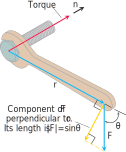

# 📝Definition
Torque is a measure of the force that can cause an object to rotate about an axis.

**📝Definition of torque vector**
The torque vector points in the direction of the axis of the bolt according to the right-hand rule (so the rotation is counterclockwise when viewed from the tip of the vector).
$$
\text{Torque vector}=(\lVert\mathbf{r}\rVert \lVert\mathbf{F}\rVert\sin\theta)\mathbf{n}
$$
or
$$
\text{Torque vector}=\mathbf{r}\times\mathbf{F}
$$

**📝Definition of magnitude of the torque**
The magnitude of the torque depends on how far out on the wrench the force is applied and on how much of the force is perpendicular to the wrench at the point of application.

The number we use to measure the torque’s magnitude is the product of the length of the lever arm $\mathbf{r}$ and the scalar component of $\mathbf{F}$ perpendicular to $\mathbf{r}$.
$$
\text{Magnitude of torque vector}=\lVert\mathbf{r}\rVert \lVert\mathbf{F}\rVert\sin\theta
$$

> [!info] Remark
> Recall that we defined $\mathbf{u}\times\mathbf{v}$ to be $0$ when $\mathbf{u}$ and $\mathbf{v}$ are parallel. This is **consistent** with the torque interpretation as well! A beautiful match between #mathematics and #physics ! If the force $\mathbf{F}$ is parallel to the wrench, meaning that we are trying to turn the bolt by pushing or pulling along the line of the wrench’s handle, the torque produced is zero.

# ✒Notation
$$
\begin{align}
\boldsymbol {\tau }&= \mathbf {r} \times \mathbf {F}\\
\tau &=\lVert\mathbf {r} \rVert\,\lVert\mathbf {F} \rVert\sin \theta
\end{align}
$$
where
- ${\boldsymbol {\tau }}$ is the torque vector
- ${\displaystyle \tau }$ is the magnitude of the torque
- ${\displaystyle \mathbf {r} }$  is the position vector (a vector from the point about which the torque is being measured to the point where the force is applied),
- ${\displaystyle \mathbf {F} }$  is the force vector,
- ${\displaystyle \times }$ denotes the [[cross product]], which produces a vector that is perpendicular to both ${\displaystyle \mathbf {r} }$ and ${\displaystyle \mathbf {F} }$ following the right-hand rule,
- ${\displaystyle \theta }$ is the angle between the force vector and the lever arm vector.

# 🧠Intuition
Find an intuitive way of understanding this concept.

# 🗃Example
Example is the most straightforward way to understand a mathematical concept.

# 🌱Related Elements
The closest pattern to current one, what are their differences?

# 🍂Unorganized