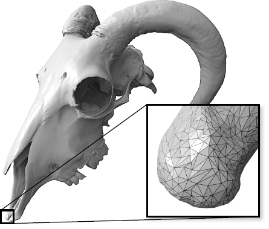

- ✒Notation
  **==Explicit mesh representation==**⭐
  - The following is the typical *_explicit_* mesh representation of a discrete surface immersed in $\mathbb{R}^3$.
  - 🧠Intuition
      - The information in  `V`  alone is purely positional and encodes the ***geometry*** of the surface.
      - The information in  `F`  alone is purely combinatoric and encodes the ***topology*** of the surface.
      
  - 📝Definition
      - $V$ - The matrix `V` is $|V|$ by 3 in size.
          - $$
            \begin{array}{rc}
            &\begin{matrix}\\v_1\\v_2\\\vdots\\v_n\end{matrix}
            &\begin{array}{ccc}
            	&\begin{matrix}x&&y&&z\end{matrix}\\
            	&\begin{bmatrix}v_{1x}&v_{1y}&v_{1z}\\v_{2x}&v_{2y}&v_{2z}\\\vdots&\vdots&\vdots\\v_{nx}&v_{ny}&v_{nz}\\\end{bmatrix}
            	&\begin{matrix}\end{matrix}\end{array}
            \end{array}
            $$
          - the $i$th row of this matrix contains the $x, y$ and $z$ coordinates of the $i$th vertex of the mesh.
          
      - $E$ - The matrix `E` is $|E|$ by 2 size.
          - $$
            \begin{array}{rc}
            &\begin{matrix}\\e_1\\e_2\\\vdots\\e_n\end{matrix}
            &\begin{array}{ccc}
            	&\begin{matrix}v_i&&v_j\end{matrix}\\
            	&\begin{bmatrix}e_{1v_i}&e_{1v_j}\\e_{2v_i}&e_{2v_j}\\\vdots&\vdots\\e_{nv_i}&e_{nv_j}\\\end{bmatrix}
            	&\begin{matrix}\end{matrix}\end{array}
            \end{array}
            $$
          - the $j$th row of this matrix is the vertex indices from $V$. Note that the order of the vertex doesn't matter here!! e.g. (1,4) and (4,1) is the same edge.
          
      - $F$ - The matrix `F` is $|F|$ by 3 in size.
          - $$
            \begin{array}{rc}
            &\begin{matrix}\\f_1\\f_2\\\vdots\\f_n\end{matrix}
            &\begin{array}{ccc}
            	&\begin{matrix}v_i&&v_j&&v_k\end{matrix}\\
            	&\begin{bmatrix}f_{1v_i}&f_{1v_j}&f_{1v_k}\\f_{2v_i}&f_{2v_j}&f_{2v_k}\\\vdots&\vdots&\vdots\\f_{nv_i}&f_{nv_j}&f_{nv_k}\\\end{bmatrix}
            	&\begin{matrix}\end{matrix}\end{array}
            \end{array}
            $$
          - the $k$th row of this matrix contains the indices into the rows of `V` of the first, second and third corners of the $j$th triangle as a non-negative number (remember in C++ arrays and matrices start with index `0`).
          - ![[simplicial complex#^b0e241]]
          
- ⛈Characteristics / Properties
    - ![[manifold#🏷Categories#🔖Manifold Triangle Mesh]]
    
- 🧀Applicability
    - 3D Image Generation
        - 🚀Benefit / Pros
            - In [[Rasterization]] and [[Ray Tracing]], triangle mesh has dominant benefit.
            - 1️⃣can approximate any shape
            - 2️⃣always planar, well-defined normal
            - 3️⃣easy to interpolate data at corners by [[Barycentric Coordinates]].
            
        - 👑Importance
            - Once everything is reduced to triangles, we can focus on making an extremely well-optimized pipeline for drawing them.
            
        - 📈Diagram
            - {:height 300 :width 300}
            
