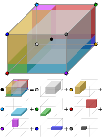
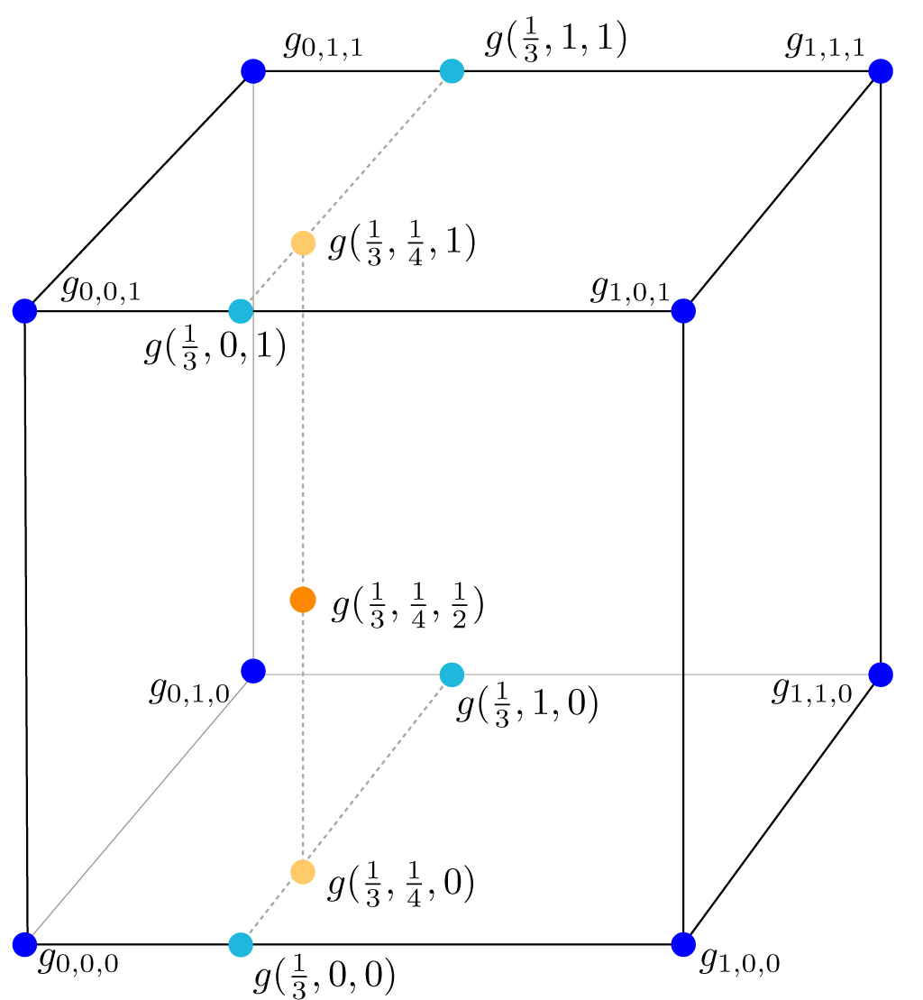

# 📝Definition
**Trilinear interpolation** is a method of multivariate interpolation on a 3-dimensional [[regular grid]]. It approximates the value of a function at an intermediate point $(x,y,z)$ within the local axial rectangular [[prism]] linearly, using function data on the lattice points.
https://en.wikipedia.org/wiki/Trilinear_interpolation
# 🧠Intuition
Trilinear interpolation is the extension of [[linear interpolation]].

# 📈Diagram

**📌A geometric visualisation of trilinear interpolation**

The product of the value at the desired point and the entire volume is equal to the sum of the products of the value at each corner and the partial volume diagonally opposite the corner.

# 🗃Example
**📁trilinear interpolation example 1** ^aa573d

Consider a point $\mathbf{x} = (\frac13 ,\frac14 ,\frac12)$ lying in the middle of the bottom-most, front-most, left-most cell. We know the values at the eight corners.
 

Trilinear interpolation can be understood as [[linear interpolation]] in the $x$-direction by $\frac13$ on each $x$-axis-aligned edge, resulting in four values _living_ on the same plane. These can then be linearly interpolated in the $y$ direction by $\frac14$ resulting in two points on the same line, and finally in the $z$ direction by $\frac12$ to get to our evaluation point $(\frac13 ,\frac14 ,\frac12 )$.

a.k.a.
1st slice is a plane
2nd slice is a line
3rd slice is a point

# 🧀Applicability
Trilinear interpolation is frequently used in [[numerical analysis]], [[data analysis]], and [[Computer Graphics]].

# 🌱Related Elements
## 🥭linear, bilinear, trilinear interpolation
**📌Commonality**
These interpolation schemes all use [[polynomial]]s of order $1$, giving an accuracy of order $2$, and it requires $2^{D}=8$ adjacent pre-defined values surrounding the interpolation point.

**📌Individuality**
- [[linear interpolation]] - operates in spaces with dimension $D=1$
- [[bilinear interpolation]] - operates in spaces with dimension $D=2$
- trilinear interpolation - operates in spaces with dimension $D=3$

# 🍂Unorganized