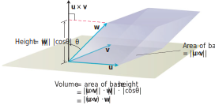

# 📝Definition
The product $(\mathbf{u}\times\mathbf{v})\cdot\mathbf{w}$ is called the triple scalar product of  $\mathbf{u},\mathbf{v}$, and $\mathbf{w}$ (in that order). The absolute value of this product is the volume of the [[parallelepiped]] determined by $\mathbf{u},\mathbf{v}$, and $\mathbf{w}$.
$$
\lvert(\mathbf{u}\times\mathbf{v})\cdot\mathbf{w}\rvert=\lVert\mathbf{u}\times\mathbf{v}\rVert\cdot\lVert\mathbf{w}\rVert\cdot\lvert\cos\theta\rvert
$$
where
- $\lVert\mathbf{u}\times\mathbf{v}\rVert$ is the area of the base [[parallelogram]].
- $\lVert\mathbf{w}\rVert\cdot\lvert\cos\theta\rvert$ is the parallelepiped’s height.

___
The preceding treats $\mathbf{u},\mathbf{v}$ as the base and we can also treat $\mathbf{v},\mathbf{w}$ or $\mathbf{w},\mathbf{u}$ as their base.
$$
\begin{align}
\left[\mathbf{u},\mathbf{v},\mathbf{w}\right]
&\equiv \lvert(\mathbf{v}\times\mathbf{w})\cdot\mathbf{u}\rvert\\
&\equiv \lvert(\mathbf{w}\times\mathbf{u})\cdot\mathbf{v}\rvert\\
&\equiv \lvert(\mathbf{u}\times\mathbf{v})\cdot\mathbf{w}\rvert
\end{align}
$$
The triple scalar product can be evaluated as a [[determinant]]:
$$
(\mathbf{u}\times\mathbf{v})\cdot\mathbf{w}=
\begin{vmatrix}
u_1&u_2&u_3\\
v_1&v_2&v_3\\
w_1&w_2&w_3\\
\end{vmatrix}
$$

# 🧠Intuition
Find an intuitive way of understanding this concept.

# 🗃Example
- 📁triple scalar product example 1
	- 💬Question: Find the volume of the box (parallelepiped) determined by $u = i + 2j - k, v = -2i + 3k$, and $w = 7j - 4k$.
	- 🏹Strategy:
		- Write in matrix format in #julia , solve it.
	- ✏Solution:
		- `D=[1 2 -1; -2 0 3; 0 7 -4;]`
		- `abs(det(D))`
		- We got `23`

# 🌱Related Elements
The closest pattern to current one, what are their differences?

# 🍂Unorganized