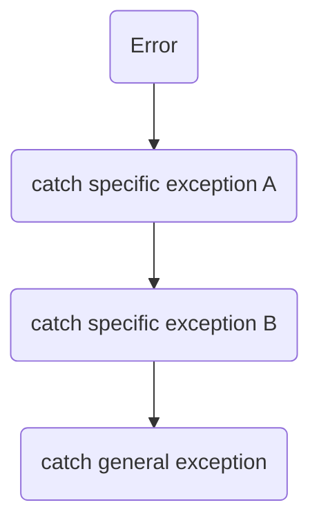

# 🚿Source
`try-catch` is just a mechanism for [[Error-Handling]], so what is its source? What kinds of error does `try-catch` block encounter?
- #cpp , #csharp use [[Exception]].


# #csharp 
## 🧠Intuition
```csharp
try
{
    //the code may have errors
}
catch (Exception ex)
{
    //handle the exception
}
```


## ⌨Sample Code
📌order the catch with by inheritance
With [[Exception#Inheritance|inheritance characteristic]] of `Exception`, a #BestPractice is to handle the **specific exception in the head** and **general exception at the tail**.

The following codes are an example.
```csharp
try
{
}
catch(FormatException fEx)
{
}
catch(OverflowException oEx)
{
}
catch(Exception ex)
{
}
```

# #cpp 

...


# #Python 


# #JavaScript 