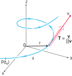

# 📝Definition

**📄Definition**
If $C$ is a smooth curve defined by the [[vector-valued function|vector function]] $\mathbf{r}$, recall that the unit tangent vector $\mathbf{T}(t)$ is given by
$$
\mathbf{T}(t)=\frac{\mathbf{r}'(t)}{\lVert\mathbf{r}'(t)\rVert}
$$
and indicates the direction of the curve.

**📑Definition**
Let
$$
\mathbf{r}(t) = x(t)\mathbf{i} + y(t)\mathbf{j} + z(t)\mathbf{k}, a \leq t \leq b
$$
be the [[position vector]] of a space curve that is smooth - meaning that the [[velocity vector]] $\mathbf{v}(t) = \mathbf{r}'(t)$ is *nonzero*. Then the curve's unit tangent vector at the point $\mathbf{r}(t)$ is the [[unit vector]]
$$
\mathbf{T}(t)=\frac{\mathbf{v}(t)}{\lVert\mathbf{v}(t)\rVert}=\frac{\mathbf{v}(t)}{v(t)},
$$
where $v(t) = \lVert \mathbf{v}(t)\rVert$ is the speed, a [[real-valued function]].

**📃Definition**
For a curve with [[position vector|radius vector]] $\mathbf{r}(t)$, the unit tangent vector $\hat{\mathbf{T}}(t)$ is defined by
$$
\begin{align}
\hat{\mathbf{T}}(t)&\equiv \frac{\dot{\mathbf{r}}}{\lVert\dot{\mathbf{r}} \rVert}\\
&=\frac{d\mathbf{r}}{ds}
\end{align}
$$
where
- $t$ is the parameterization variable
- $s$ is the [[arc length]]
- an overdot denotes a derivative with respect to $t$, e.g. $\dot{\mathbf{r}}=d\mathbf{r}/dt$

# 🧠Intuition
Find an intuitive way of understanding this concept.

# 🗃Example
- 📁unit tangent vector example
	- 💬Question: Find the unit tangent vector of the curve $$\mathbf{r}(t) = (1+3\cos t)\mathbf{i} + (3\sin t)\mathbf{j} + t^2\mathbf{k}$$
	- ✏Solution:
		- Compute $\mathbf{v}(t)$
			- $$\begin{align}\mathbf{v}(t)&=\mathbf{r}'(t) \\&= (-3\sin t)\mathbf{i} + (3\cos t)\mathbf{j} + 2t\mathbf{k}\end{align}$$
		- Compute $\lVert\mathbf{v}(t)\rVert$
			- $$\begin{align}\lVert\mathbf{v}(t)\rVert&=\sqrt{(-3\sin t)^2+(3\cos t)^2+(2t)^2}=\sqrt{9+4t^2}\end{align}$$
		- Therefore 
			- $$\mathbf{T}(t)=\frac{\mathbf{v}(t)}{\lVert\mathbf{v}(t)\rVert}=\frac{\mathbf{v}(t)}{v(t)}={-3\sin t\over\sqrt{9+4t^2}}\mathbf{i} + {3\cos t\over\sqrt{9+4t^2}}\mathbf{j} + {2t\over\sqrt{9+4t^2}}\mathbf{k}$$

# 🌱Related Elements
The closest pattern to current one, what are their differences?

# 🍂Unorganized