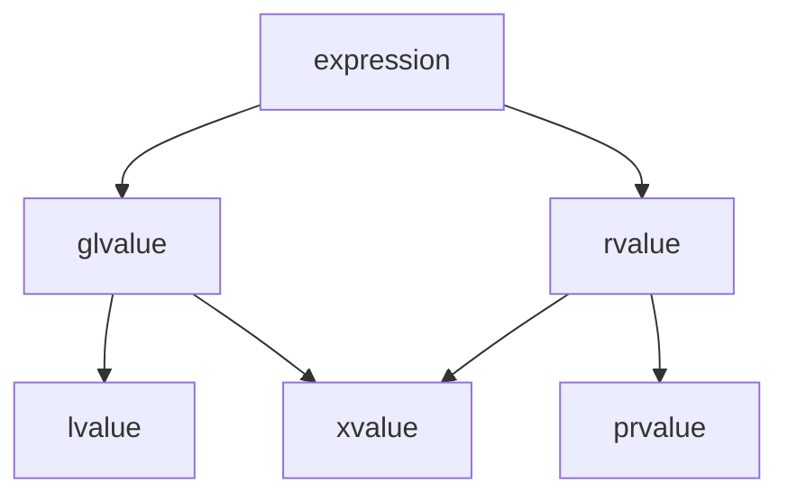

# 📝Definition
**lvalue**
An entity has a name. It must be able to take the address of using the [[address-of operator]].

**rvalue**
An entity does not have a name. It does not have [[memory|memory address]]. It has data and it is usually a temporary value. e.g. [[Literal]].
Lifetime

> [!info] Info
> A [[value]] is either an lvalue or an rvalue. Any other value categories are just the **refinement** to these two.

**gvalue**
A gvalue is the "generalized" lvalue.
- It is an lvalue or an xvalue.
- It has identity.
- It may or may not be removed from.

**prvalue**
A prvalue is the "pure" rvalue.
- It does not have an identiy.
- It can be moved from.
- It is an rvalue that is not an xvalue.
- The result of calling a function whose return type is not a reference is a prvalue.

**xvalue**
An xvalue is an "expiring" value.
- It has an identity.
- It can be moved from.
- The result of certain kinds of expression involving [[Reference Type|rvalue reference]]
- The result of calling a function whose return type is an rvalue reference, is an xvalue.
- e.g. `std::move(x)`




By #EricRoberts , 
> In #cpp , any expression that refers to an internal memory location capable of storing data is called ==lvalue==.

By #CppPrimer, 
> an lvalue expression yields an object or a function.

By 👨‍🔬Herb Sutter
> Everything that has a name is a lvalue, everything that doesn't is a rvalue.

By 👨‍🔬Stephan T. Lavavej
> If you can get its address, its an lvalue, otherwise its an rvalue.

rvalue has data but it does not have [[memory|memory address]]. e.g. [[Literal]].


# 🗃Example
📌lvalue and rvalue example 1
```cpp
int num = 3;
```
- `num` is lvalue.
- `3` is rvalue.
Here is a summary.
|                | `num`  | `3`    |
| -------------- | ------ | ------ |
| value category | lvalue | rvalue |
| [[type]]      | `int`  | `int`  |


📌lvalue and rvalue example 2
```cpp
Widget *pw = new Widget;  //line 1
(*pw).doSomething();      //line 2
```
- line1: `pw` is an lvalue, its [[type|data type]] is "pointer to Widget", a.k.a. `Widget*
- line2: `*pw` is an lvalue as well. Although it does not have a name, but we can take the address of `*pw` 

> [!NOTE] Note
> The semantics of  [[asterisk]] symbol in line 1 and line 2 are different.
> - in line 1, it is part of the declaration of a [[pointer]].
> - in line 2, it is a [[dereference operator]].

📌lvalue and rvalue example 3
```cpp
int i = 3;       //✅an lvalue
i = 4;

const int j = 4; //✅an lvalue
j = 5;           //❌ERROR
```
Although `j` can be modfied since it is `const`, it is still an lvalue. (we can have its [[memory|memory address]])


# ✒Notation
***lvalue*** pronounced "ell-value".
***rvalue*** pronounced "are-value".
# ⛈Properties
The following properties apply to lvalues in C++:
- Every lvalue is stored somewhere in [[memory]] and therefore has an [[memory|memory address]].
- Once it has been declared, the address of an lvalue never changes, even though
the contents of those memory locations may change.
- The address of an lvalue is a [[pointer]] value, which can be stored in memory and
manipulated as data.

# 🌓Complement
lvalue - rvalue

