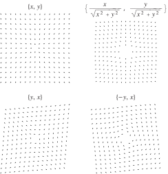

# 📝Definition
A vector field is a [[Function|map]]
$$
\mathbf{f}:\mathbb{R}^n\mapsto \mathbb{R}^n
$$
that assigns each $\mathbf{x}$ a vector $\mathbf{f(x)}$.

# 🧠Intuition
Find an intuitive way of understanding this concept.

# 🗃Example
**📁vector field example 1**

# 🌱Related Elements
The closest pattern to current one, what are their differences?

# 🍂Unorganized