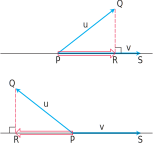
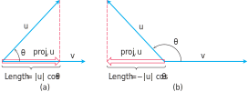
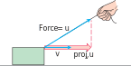

# 📝Definition
The vector projection of $\mathbf{u} = \overrightarrow{PQ}$ onto a nonzero vector $\mathbf{v} = \overrightarrow{PS}$ is the vector $\overrightarrow{PR}$ determined by dropping a perpendicular from $Q$ to the line $PS$. The notation for this vector is
$$
\begin{align}
\text{proj}_\mathbf{v}\mathbf{u}\quad\text{("the vector projection of $\mathbf{u}$ onto $\mathbf{v}$".)}
&=\left(\lVert\mathbf{u}\rVert\cos{\theta}\right)\frac{\mathbf{v}}{\lVert\mathbf{v}\rVert}\\
&=\left(\lVert\mathbf{u}\rVert \frac{\mathbf{u}\cdot\mathbf{v}}{\lVert\mathbf{u}\rVert\lVert\mathbf{v}\rVert}  \right)\frac{\mathbf{v}}{\lVert\mathbf{v}\rVert}\quad\text{(equation from the dot product)}\\
&=\left(\cancel{\lVert\mathbf{u}\rVert} \frac{\mathbf{u}\cdot\mathbf{v}}{\cancel{\lVert\mathbf{u}\rVert}\lVert\mathbf{v}\rVert}  \right)\frac{\mathbf{v}}{\lVert\mathbf{v}\rVert}\\
&=\left(\frac{\mathbf{u}\cdot\mathbf{v}}{\lVert\mathbf{v}\rVert}\right)\frac{\mathbf{v}}{\lVert\mathbf{v}\rVert}\\
&=\left(\frac{\mathbf{u}\cdot\mathbf{v}}{\lVert\mathbf{v}\rVert^2}\right)\mathbf{v}
\end{align}
$$

> [!info] Remark
> The 2nd equation can be derived from the 1st using [[angle between vectors]].

The number $|\mathbf{u}|\cos{\theta}$ is called **the scalar component of $\mathbf{u}$ in the direction of $\mathbf{v}$** (or of $\mathbf{u}$ onto $\mathbf{v}$). a.k.a. the length of $\text{proj}_\mathbf{v}\mathbf{u}$.

The length of $\text{proj}_\mathbf{v}\mathbf{u}$ is
- (1) $\lVert\mathbf{u}\rVert\cos{\theta}$ if $\cos\theta\geq0$
- (2) $-\lVert\mathbf{u}\rVert\cos{\theta}$ if $\cos\theta<0$

# 🧠Intuition
Find an intuitive way of understanding this concept.

# 📈Diagram

# 🗃Example
- 🗂vector projection example 1
	- 💬Question: Find the vector projection of $\mathbf{u} = 6\mathbf{i} + 3\mathbf{j} + 2\mathbf{k}$ onto $\mathbf{v} = \mathbf{i} - 2\mathbf{j} - 2\mathbf{k}$ and the scalar component of $\mathbf{u}$ in the direction of $\mathbf{v}$.
	- ✏Solution:
		- (1)vector projection
			- $$\begin{align}\text{proj}_\mathbf{v}\mathbf{u}&=\left(\frac{\mathbf{u}\cdot\mathbf{v}}{|\mathbf{v}|^2}\right)\mathbf{v}\\&=\frac{(6)(1)+(3)(-2)+(2)(-2)}{(1)(1)+(-2)(-2)+(-2)(-2)}\mathbf{i} - 2\mathbf{j} - 2\mathbf{k}\\&=-\frac{4}{9}(\mathbf{i} - 2\mathbf{j} - 2\mathbf{k})\\&=-\frac{4}{9}\mathbf{i}+\frac{8}{9}\mathbf{j}+\frac{8}{9}\mathbf{k}\end{align}$$
		- (2)scalar component
			- $$\begin{align}|\mathbf{u}|\cos\theta&=\mathbf{u}\cdot\frac{\mathbf{v}}{|\mathbf{v}|}\\&=(6\mathbf{i} + 3\mathbf{j} + 2\mathbf{k})\cdot(\frac{1}{3}\mathbf{i} - \frac{2}{3}\mathbf{j} - \frac{2}{3}\mathbf{k})\\&=2-2-\frac{4}{3}=-\frac{4}{3}\end{align}$$

📁
📩
🗂
📨
📂

# 🧀Applicability
In #physics , if we pull on the box with force $\mathbf{u}$, the effective force moving the box forward in the direction v is the projection of $\mathbf{u}$ onto $\mathbf{v}$.

# 🌱Related Elements
The closest pattern to current one, what are their differences?

# 🍂Unorganized