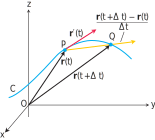

# 📝Definition

**domain is interval of real numbers**
A vector-valued function is simply a [[function]] whose [[domain]] is a [set] of [[real number]]s and whose [[range]] is a set of [[vector]]s. This means that for every number $t$ in the domain of $\mathbf{r}$ there is a unique vector in $V_3$ denoted by $\mathbf{r}(t)$. If $f(t), g(t)$ and $h(t)$ are the components of the vector $\mathbf{r}(t)$, then $f, g$, and $h$ are [[real-valued function]]s called the **component functions** of $\mathbf{r}$ and we can write
$$
\mathbf{r}(t)=\left< f(t),g(t),h(t) \right>=f(t)\mathbf{i}+g(t)\mathbf{j}+h(t)\mathbf{k}
$$

**domain in plane**

**domain in space**

# 🧠Intuition
Find an intuitive way of understanding this concept.

# 🗃Example
see [[velocity vector]]

# ⚖Theorem
Differentiation Rules for Vector Functions
- 1️⃣ Constant Function Rule:
	- $\frac{d}{dt}\mathbf{C}=\mathbf{0}$
- 2️⃣ Scalar Multiple Rules:
	- $\frac{d}{dt}[c\mathbf{u}(t)]=c\mathbf{u}'t$
	- $\frac{d}{dt}[f(t)\mathbf{u}(t)]=f'(t)\mathbf{u}(t)+f(t)\mathbf{u}'(t)$
- 3️⃣ Sum Rule:
	- $\frac{d}{dt}[\mathbf{u}(t)+\mathbf{v}(t)]=\mathbf{u}'(t)+\mathbf{v}'(t)$
- 4️⃣ Difference Rule:
	- $\frac{d}{dt}[\mathbf{u}(t)-\mathbf{v}(t)]=\mathbf{u}'(t)-\mathbf{v}'(t)$
- 5️⃣ Dot Product Rule:
	- $\frac{d}{dt}[\mathbf{u}(t)\cdot\mathbf{v}(t)]=\mathbf{u}'(t)\cdot\mathbf{v}(t)+\mathbf{u}(t)\cdot\mathbf{v}'(t)$
- 6️⃣ Cross Product Rule:
	- $\frac{d}{dt}[\mathbf{u}(t)\times\mathbf{v}(t)]=\mathbf{u}'(t)\times\mathbf{v}(t)+\mathbf{u}(t)\cdot\mathbf{v}'(t)$
- 7️⃣ Chain Rule:
	- $\frac{d}{dt}[\mathbf{u}(f(t))]=f'(t)\mathbf{u}'(f(t))$

# 🌈Properties
## 🔴limit
**📝Definition**
Let $\mathbf{r}(t) = f(t)\mathbf{i} + g(t)\mathbf{j} + h(t)\mathbf{k}$ be a vector function with [[domain]] $D$, and $\mathbf{L}$ a [[vector]]. We say that $\mathbf{r}$ has [[limit]] $\mathbf{L}$ as $t$ approaches $t_0$ and write
$$
\lim_{t\to t_0}\mathbf{r}(t)=\mathbf{L}
$$
if, for every number $\epsilon>0$, there exists a corresponding number $\delta> 0$ such that for all $t\in D$
$$
\lvert\mathbf{r}(t)-\mathbf{L}\rvert < \epsilon\quad\text{whenever}\quad 0<\lvert t-t_0\rvert <\delta.
$$
**🗃Example**
If $\mathbf{r}(t) = \cos(t)\mathbf{i} + \sin(t)\mathbf{j} + t\mathbf{k}$, then
$$
\begin{align}
\lim_{t\to\pi/4}\mathbf{r}(t)
&= \left(\lim_{t\to\pi/4}\cos t\right)\mathbf{i} + \left(\lim_{t\to\pi/4}\sin t\right)\mathbf{j} + \left(\lim_{t\to\pi/4} t\right)\mathbf{k}
\\
&=\frac{\sqrt{2}}{2}\mathbf{i} + \frac{\sqrt{2}}{2}\mathbf{j} + \frac{\pi}{4}\mathbf{k}
\end{align}
$$

## 🟠continuous
**📝Definition**
A vector function $\mathbf{r}(t)$ is [[continuity|continuous]] at a point $t = t_0$ in its [[domain]] if $\lim_{t\to t_0} \mathbf{r}(t) = \mathbf{r}(t_0)$. The function is continuous if it is continuous over its [[interval]] domain.

**🗃Example**
- $\mathbf{r}(t) = \cos(t)\mathbf{i} + \sin(t)\mathbf{j} + t\mathbf{k}$ is continuous.
- $\mathbf{g}(t) = \cos(t)\mathbf{i} + \sin(t)\mathbf{j} + \lfloor t\rfloor\mathbf{k}$ is not continuous. Because the greatest integer function $\lfloor t\rfloor$ is discontinuous.

## 🟡differentiable
**📝Definition**
The vector function $\mathbf{r}(t) = f(t)\mathbf{i} + g(t)\mathbf{j} + h(t)\mathbf{k}$ has a [[derivative]] (is differentiable) at $t$ if $f, g$, and $h$ have derivatives at $t$. The derivative is the vector function
$$
\mathbf{r}'(t) = \frac{d\mathbf{r}}{dt} = \lim_{\Delta t\to0}\frac{\mathbf{r}(t+\Delta t)-\mathbf{r}(t)}{\Delta t}=\frac{df}{dt}\mathbf{i} + \frac{dg}{dt}\mathbf{j} + \frac{dh}{dt}\mathbf{k}.
$$
> [!info] Remark
> A vector function $\mathbf{r}$ is differentiable if it is differentiable at every point of its domain. The curve traced by $\mathbf{r}$ is smooth if $d\mathbf{r} >dt$ is continuous and never 0, that is, if $f, g$, and $h$ have continuous first derivatives that are **not simultaneously** 0.

## 🟢antiderivative
### 📝Definition
The indefinite integral of $\mathbf{r}$ with respect to $t$ is the set of all [[antiderivative]]s of $\mathbf{r}$, denoted by $\int\mathbf{r}(t) dt$. If $\mathbf{R}$ is any antiderivative of $\mathbf{r}$, then
$$
\int \mathbf{r}(t)dt=\mathbf{R}(t)+\mathbf{C}.
$$

### 🗃Example
- 📁vector-valued function antiderivative example
	- 💬Question: To integrate a vector function, we integrate each of its components.
	- ✏Solution:
		- $$\begin{align}\int((\cos t)\mathbf{i}+\mathbf{j}-2t\mathbf{k})dt&=(\int\cos t\space dt)\mathbf{i}+(\int dt)\mathbf{j}-(\int 2t\space dt)\mathbf{k}\\&=(\sin t+C_1)\mathbf{i}+(t+C_2)\mathbf{j}-(t^2+C_3)\mathbf{k}\\&=(\sin t)\mathbf{i}+t\mathbf{j}-t^2\mathbf{k}+\mathbf{C}\quad\quad\quad \text{as }C=C_1\mathbf{i}+C_2\mathbf{j}-C_3\mathbf{k}\end{align}$$

- 📩vector-valued function antiderivative example 2
	- 💬Question: Suppose we do not know the path of a hang glider, but only its acceleration vector $\mathbf{a}(t) = -(3 \cos t)\mathbf{i} - (3 \sin t)\mathbf{j} + 2\mathbf{k}$. We also know that initially (at time $t = 0$) the glider departed from the point $(4, 0, 0)$ with velocity $\mathbf{v}(0) = 3\mathbf{j}$. Find the glider’s position as a function of $t$.
	- 🗣Answer:
		- Find $\mathbf{v}$ and then find $\mathbf{r}$.
	- ✏Solution:
		- Find $\mathbf{v}$
			- Take the antiderivative of $\mathbf{a}(t) = -(3 \cos t)\mathbf{i} - (3 \sin t)\mathbf{j} + 2\mathbf{k}$
			- $\mathbf{v}=\int \mathbf{a}(t) = -(3 \sin t)\mathbf{i} + (3 \cos t)\mathbf{j} + 2t\mathbf{k}+\mathbf{C}_1$
			- We use the initial condition $\mathbf{v}(0) = 3\mathbf{j}$ to solve $\mathbf{C}_1$
			- $$\begin{align}\mathbf{v}(0) = 3\mathbf{j}&=-(3 \sin 0)\mathbf{i} + (3 \cos 0)\mathbf{j} + 2(0)\mathbf{k}+\mathbf{C}_1\\3\mathbf{j}&=0\mathbf{i} + 3\mathbf{j} + 0\mathbf{k}+\mathbf{C}_1\\3\mathbf{j}&=3\mathbf{j}+\mathbf{C}_1\\\mathbf{C}_1&=0\end{align}$$
			- Therefore the equation for $\mathbf{v}$ is
				- $\mathbf{v} = -(3 \sin t)\mathbf{i} + (3 \cos t)\mathbf{j} + 2t\mathbf{k}$
		- Find $\mathbf{r}$
			- Follow the same pattern.
			- $\mathbf{r}=\int\mathbf{v} = (3 \cos t)\mathbf{i} + (3 \sin t)\mathbf{j} + t^2\mathbf{k}+\mathbf{C}_2$
			- We use the initial condition $\mathbf{r}(0) = (4,0,0)$ to solve $\mathbf{C}_2$
			- $$\begin{align}\mathbf{r}(0)=(4,0,0)&= (3 \cos 0)\mathbf{i} + (3 \sin 0)\mathbf{j} + 0^2\mathbf{k}+\mathbf{C}_2\\(4,0,0)&=3\mathbf{i}+\mathbf{C}_2\\\mathbf{C}_2&=\mathbf{i}\end{align}$$
			- The glider’s position as a function of $t$ is
				- $\mathbf{r} = (3 \cos t+1)\mathbf{i} + (3 \sin t)\mathbf{j} + t^2\mathbf{k}$

## 🔵definite integral
### 📝Definition
If the components of $\mathbf{r}(t) = f(t)\mathbf{i} + g(t)\mathbf{j} + h(t)\mathbf{k}$ are integrable over $[a, b]$ , then so is $\mathbf{r}$, and the [[definite integral]] of $\mathbf{r}$ from $a$ to $b$ is
$$
\int_{a}^{b}\mathbf{r}(t)dt=(\int_a^b f(t)\space dt)\mathbf{i}+(\int_a^b g(t)\space dt)\mathbf{j}+(\int_a^b h(t)\space dt)\mathbf{k}
$$
### 🗃Example
**📁example 1**
To integrate a vector function, we integrate each of its components.
$$
\begin{align}
\int_0^\pi((\cos t)\mathbf{i}+\mathbf{j}-2t\mathbf{k})dt&=(\int_0^\pi\cos t\space dt)\mathbf{i}+(\int_0^\pi dt)\mathbf{j}-(\int_0^\pi 2t\space dt)\mathbf{k}\\
&=[\sin t]_0^\pi\mathbf{i}+[t]_0^\pi\mathbf{j}-[t^2]_0^\pi\mathbf{k}\\
&=[0-0]\mathbf{i}+[\pi-0]\mathbf{j}-[\pi^2-0]\mathbf{k}\\
&=\pi\mathbf{j}-\pi^2\mathbf{k}
\end{align}
$$
___

🟣

# 🌱Related Elements
The closest pattern to current one, what are their differences?

# 🍂Unorganized