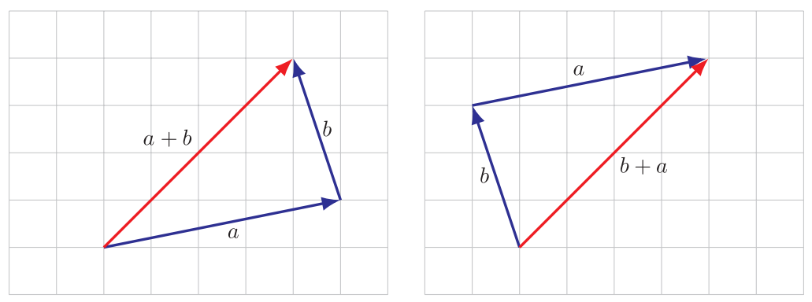
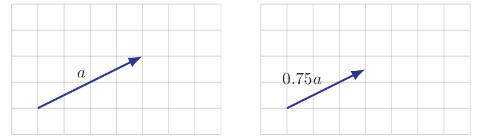
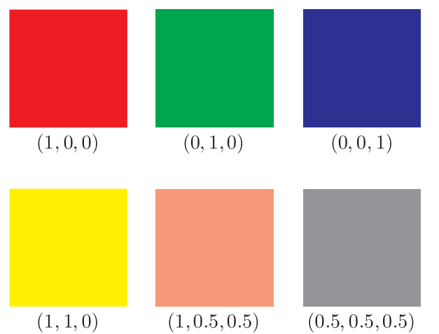
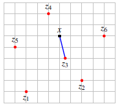
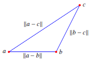

- ## 📝Definition
  The name is the essence of this topic.
	- In mathematics,
		- Vector is a sequence of finite numbers / values. Normally it looks something like this:
			- in algebraic
			  $$
			  V = \langle V_1,V_2,...,V_N\rangle
			  $$
			- in numbers
			  $$
			  \begin{bmatrix}1\\2\\3\end{bmatrix}
			  \text{or}
			  \begin{pmatrix}1\\2\\3\end{pmatrix}
			  $$
	- In C++,
		- The [[STL]] wraps the concept from mathematics into `std::vector`.
- # ✒Notation
	- 📌column picture of vector
		- vector $V$ (**column picture**) represented by a matrix with 1 column and $n$ rows:
		- $$
		  V = \begin{bmatrix}V_1\\V_2\\\vdots\\V_n\end{bmatrix}
		  $$
	- 📌row picture of vector
		- vector $V$ (**row picture**) ,the transpose of their corresponding column vectors:
		- $$
		  V^T = [V_1\quad V_2\quad \cdots\quad  V_n ]
		  $$
	- 📌colon notation and index range
		- $a_{r:s}$ means slicing index $r$ to index $s$ elements in vector $a$. The size is $s-r+1$
	- 📌indexing
		- when you see $a_i$ , there might be 2 different meaning.
			- the $i$-th vector in the collection of vectors.
			- the $i$-th element in the vector.
		- Therefore, for clarity. We use
			- $a_i$ as the $i$-th vector.
			- $(a_i)j$ as the $j$-th element of the $i$-th vector.
- ## 🧪Composition
  What kind of stuffs composite this subject?
	- 📌In mathematics, the individual element of a vector can be called into 4 names.
		- elements
		- entries
		- coefficients
		- components
- ## ⛈Characteristics / Properties
  The following are few properties of vector.
	- 📌Length of a vector
		- They are the same, naming how long is the vector.
			- size
			- dimension
			- length
	- 📌 [[Sparsity]]
		- If there are many zero elements in one vector, then we can say this vector is sparse vector.
		- The number of nonzero elements in a vector $a$ can be denoted:
		  $$
		  nnz(a)
		  $$
	- 📌 [[Linear Dependence]] and [[Linear Independence]]
	- 📌 Angle
	- 📌 [[Euclidean Norm]]
		- **magnitude/norm** of an $n$-dimensional vector $V$ is a **scalar**.
		- $$
		  \lVert V\rVert = \sqrt{\sum^{n}_{i=1}{V_i^2}}
		  $$
	- 📌 [[Orthonormality]]
	- 📌[[Complexity]] of Vector Operation
		- Side Note
			- For the following statement, the complexity refers to the number of [flops](((632141f6-8c0c-40c2-bab8-bce388937019))) required by a specific method.
		- For normal vectors
			- $n$ times
				- scalar-vector multiplication and division of $n$-vector , e.g. $aV$
				- vector addition and subtraction  $n$-vector, e.g. $P+V$
			- $2n$ times
				- inner product of  $n$-vectors, e.g. $P^TV = P_1V_1+\cdots+P_nV_n$. Multiplication takes $n$ times, addition takes $n-1$ times. But for simplicity, we denote as $2n$ times.
		- For [[sparse]] vectors
			- Suppose $x,y$ are sparse vectors and $a$ is scalar.
			- Then we have
				- $ax$ takes $nnz(x)$ times.
				- $x+y$ takes
					- less than $\min\{\bold{nnz}(x),\bold{nnz}(y)\}$ times
					- 0 times if $x$ and $y$ have zero overlapped.
				- $x^Ty$ takes
					- less than $2\min\{\bold{nnz}(x),\bold{nnz}(y)\}$
					- 0 times if they are not overlapped.
- ## 🏷(Sub)Categories
  In terms vector, there are many byproduct.
	- 📌block or stacked vector
		- Sometimes it is very convenient to *concatenate* or *stack* vectors.
		- Mathematical representation
			- $$
			  a=\begin{bmatrix}a_1\\\vdots\\a_m\end{bmatrix},
			  b=\begin{bmatrix}b_1\\\vdots\\b_n\end{bmatrix},
			  \\\\
			  A=\begin{bmatrix}a_1\\\vdots\\a_m\\b_1\\\vdots\\b_n\end{bmatrix}
			  $$
		- Code Representation
			- Python version refer to [here](((631b60a1-ec78-400a-a5da-2aa61bd72050)))
	- 📌subvector or slice
		- We call $a, b, c$ as the *subvector / slice*  of [[matrix]] $A$.
	- 📌zero vector
		- $0_n$ represents a $n$-vector with all 0.
	- 📌Ones Vector
		- Size of $n$-vector with all $1$ inside.
	- 📌unit vector
		- One unit vector only has one nonzero element.
		  $$
		  e_1 = \begin{bmatrix}1\\0\\0\end{bmatrix},
		  e_2 = \begin{bmatrix}0\\1\\0\end{bmatrix},
		  e_3 = \begin{bmatrix}0\\0\\1\end{bmatrix}
		  $$
		- More formally, a unit vector is a vector of length 1, sometimes also called a direction vector. You can do a [vector normalization](((633572bd-8953-408f-973c-2530efb4749e))) to have a unit vector.
			- $$
			  \hat{v}\equiv\frac{v}{\lvert v\rvert}
			  $$
	- 📌Sparse Vector
		- A vector contains too many zero elements in one vector.
- ## 🎯Intent
   A short description what does this thing do?
- ## 🧠Intuition
  Find an intuitive way of explanation of this concept.
- ## 🚀Benefit
   A scenario that illustrates the benefit this object provides.
- ## 🤳Applicability
  There are many application of vector and the following are a few.
	- 📌Vector as a list of value
		- This is the computational way using vector. There are lots of example of these.
	- 📌Displacement and Location
		- A vector can either represents a *location* or a *displacement*.
		- {:height 300, :width 300}
			- example of displacement in light of the [vector addition](((631bf593-035e-40a1-97d3-f3fee67d7ebe)))
				- {:height 300, :width 300}
			- example of scaling the displacement by [scalar-vector operation](((631bf61e-6fa2-4b49-bb1e-21885cdef846)))
				- {:height 300, :width 300}
	- 📌Colors
		- The colors can be represented as vectors.
		- {:height 300, :width 300}
	- 📌Quantities
		- A $n$-vector can represent amounts of different $n$ products.
	- 📌Value Across Population
		- A $n$-vector can represent body temperature of different $n$ people.
	- 📌Image
		- This is much more "machine learning" feel. If per pixel per vector
		  $$
		  \text{Pixel}_{i,j}=\begin{bmatrix}0.8\\0.2\\0.3\end{bmatrix}
		  $$
		- Then an $8\times8$ pixels image can be flatten as:
		  $$
		  V = \begin{bmatrix}v_1,\cdots,v_n\end{bmatrix}\\
		  n = 8\times8\times3
		  $$
- ## 💫Operation
  The operations that vector supports are the following
	- 📌Vector Addition and Subtraction
	  id:: 631bf593-035e-40a1-97d3-f3fee67d7ebe
		- Prerequisite
			- The vectors have to be same shape.
			- $$
			  \begin{bmatrix}0\\7\\3\end{bmatrix}+
			  \begin{bmatrix}1\\2\\0\end{bmatrix}=
			  \begin{bmatrix}1\\9\\3\end{bmatrix}
			  $$
		- Characteristics
			- Vector addition and subtraction are element-wise operation.
			- $$
			  P+Q=\langle P_1+Q_1,P_2+Q_2,..., P_n+Q_n\rangle
			  $$
		- Properties
			- Commutative
				- $$
				  a+b = b+a
				  $$
			- Associative
				- $$
				  (a+b)+c = a+(b+c)
				  $$
	- 📌 [[scalar]]-vector multiplication
	  id:: 631bf61e-6fa2-4b49-bb1e-21885cdef846
		- Prerequisite
			- $\alpha$-scalar
			- $\beta,\gamma$ -vector
		- Intuition
			- scalar-vector operation is element-wise.
				- $$
				  aV = Va =\langle aV_1, aV_2,..., aV_n\rangle
				  $$
		- Properties
			- commutative
				- $$
				  (\beta\gamma)\alpha = \beta(\gamma\alpha)
				  $$
			- associative
				- $$
				  (\beta+\gamma)\alpha = \beta\alpha+\gamma\alpha
				  $$
		- Example
			- $$
			  (-2)\begin{bmatrix}0\\7\\3\end{bmatrix}=\begin{bmatrix}0\\-14\\-6\end{bmatrix}
			  $$
		- Applicability
			- 📌[[Linear Combination]]
	- 📌 [[Matrix-Vector Products]]
	- 📌 [[Inner Product]]
	- 📌 [[Cross Product]]
	- 📌 [RMS](((632aafb4-b82f-4e4c-ab04-6d535b486768))) (root mean square)
	- 📌 (Euclidean) distance between $n$-vectors
		- Definition
			- For $n$-vector $a,b$, it can be written as
				- $$
				  \bold{dist}(a,b)=\lVert a-b \rVert
				  $$
				- a.k.a. We usually use [[Euclidean Norm]] to measure the distance.
		- 🤳Applicability
			- Feature distance and nearest neighbors
				- The Euclidean distance is widely used!!
				- if $x$ and $y$ are feature vectors for two entities
					- $\lVert x-y\rVert$ is **the feature distance**
				- if $z_1,...,z_m$ is a list of vectors, $z_j$ is the nearest neighbor of $x$ if
					- $\lVert x-z_i\rVert \leq \lVert-z_i\rVert, i=1,...,m$
					- {:height 200, :width 200}
			- Document dissimilarity
				- This application is based on measuring feature distance!
				- Suppose we have 5 Wikipedia articles
					- ‘Veterans Day’, ‘Memorial Day’, ‘Academy Awards’, ‘Golden Globe Awards’, ‘Super Bowl’
				- Make the word count histograms, dictionary of 4423 words, a.k.a. An article now becomes a $4423$-vector
				- The pairwise distance shown below
				  |                     | Veterans Day | Memorial Day | Academy Awards | Golden Globe Awards | Super Bowl |
				  | ------------------- | ------------ | ------------ | -------------- | ------------------- | ---------- |
				  | Veterans Day        | 0            | 0.095        | 0.130          | 0.153               | 0.170      |
				  | Memorial Day        | 0.095        | 0            | 0.122          | 0.147               | 0.164      |
				  | Academy Awards      | 0.130        | 0.122        | 0              | 0.108               | 0.164      |
				  | Golden Globe Awards | 0.153        | 0.147        | 0.108          | 0                   | 0.181      |
				  | Super Bowl          | 0.170        | 0.164        | 0.164          | 0.181               | 0          |
				-
	- 📌 Vector Normalization
	  id:: 633572bd-8953-408f-973c-2530efb4749e
		- The vector divides its [[Euclidean Norm]].
		- $$
		  V\cdot\frac{1}{\lVert V\rVert}
		  $$
	- 📌 Triangle inequality
		- Definition
			- For triangle with vertices at positions $a,b,c$
			- edge lengths are
				- $$
				  \lVert a-b \rVert, \lVert b-c \rVert, \lVert a-c \rVert
				  $$
			- by triangle inequality
				- $$
				  \lVert a-c \rVert = \lVert (a-b)+(b-c) \rVert\leq \lVert a-b \rVert + \lVert b-c \rVert
				  $$
		- Intuition: third edge length is no longer than sum of other two
			- {:height 200, :width 200}
- ## ⌨Sample Code
   Code fragments
	- In C++,
		- 📌example of `std::vector` initialization
		  id:: 630eca65-d6aa-4f27-8a7a-2d9a70dcd498
		  collapsed:: true
			- the the [[{} - initialization syntax]] and [[() - initialization syntax]] have different effect!!⭐
			  collapsed:: true
				- using  `{...}`  for a list of elements
				- using `(...)`  for sizes
			- That is due to `std::initializer_list`. Calls using the braced initialization syntax strongly prefer the overloads taking `std::initializer_lists`. That's the secret behind why using  `{...}`  for a list of elements!
			  id:: 630f2612-8c29-4a0a-99cd-8a1d9f19a75a
			- ``` c++
			  // v1 is {0, 0, 0, 0, 0, 0, 0, 0, 0, 0}
			  vector<int> v1(10);
			  
			  // v2 is {10}
			  vector<int> v2{10};    // vector of 1 element with the value 10
			  
			  // v3 is -> {2}
			  vector<int> v3(1, 2);
			  
			  // v4 is -> {1, 2}
			  vector<int> v4{1, 2};
			  ```
		- example of plug C-Style array to initialize `std::vector`
		  ``` c++
		  constexpr int seq_size = 3;
		  int elem_val[seq_size] = {1, 2, 3};
		  vector<int> elem_seq(elem_val, elem_val + seq_size);
		  ```
		  `elem_val`  is actually the address passed in the vector. The  `+ seq_size`  indicates how long the array should be.
		- 📌example of using `std::vector` to count letter
			- ``` c++
			  vector<int> letternCounts(26);
			  ifstream infile;
			  promptUserForFile(infile, "Input File: ");
			  while(infile.get(ch))
			  {
			    if(isalpha(ch))
			    {
			      letterCounts[toupper(ch) - 'A']++;     //🤚Take a look here
			    }
			  }
			  infile.close();
			  for(char ch = 'A'; ch <= 'Z'; ch++)            //🤚Take a look here
			  {
			    cout << setw(7) << letterCounts[ch - 'A'] << " " << ch << endl;
			  }
			  ```
			- The most importance points lie in the following:
			  
			  ``` c++
			  letterCounts[toupper(ch) - 'A']++;
			  ```
			- It is a very smart move which takes advantage of the [ASCII code](((630eca62-179b-4f2d-b644-cfc09f4b2681))) and converts to integer. For example, `'A'` is the `0` element and therefore `'A' - 'A'` are `65 -65` which is `0`.
	- In Python,
		- 📌example of stack vector in numpy python
		  id:: 631b60a1-ec78-400a-a5da-2aa61bd72050
			- ```python
			  import numpy as np
			  a = np.array([[1],
			                [2],
			                [3]])
			  b = np.array([[4],
			                [5],
			                [6]])
			  c = np.array([[7],
			                [8],
			                [9]])
			  A = np.vstack([a,b,c])
			  ```
- ## 🧬Related Elements
   The closest pattern to current one, what are their differences?
	- 📌[[scalar]] vs. vector
		- There are *real scalar*$\mathbb{R}$ and *complex scalar*$\mathbb{C}$. In most case, we refer *real scalar* as *scalar*.
		- Therefore, we also have *real vector* and *complex vector*. In most case, we refer *real vector* as vector.
- ## 🌓Complement
  What is the complement of this subject? e.g. vector-covector, constructor-destructor
- ## 🔎Implementation
   The code or technical stuffs implement this.
- ## 🕳Pitfalls
  Be aware of the pitfalls when using this stuffs... (especially considering edge cases)
- ## 📋Prerequisite
  Some techniques and objects only work under certain condition.
- ## 🥼Expert's Advice
- ## 🧱Structure
  Any other hierarchical issues?