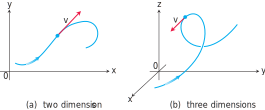

# 📝Definition
## 📄in mathematics
Vector is a sequence of finite numbers / values. Normally it looks something like this:
in algebraic
$$
V = \langle V_1,V_2,...,V_N\rangle
$$
in numbers
$$
\begin{bmatrix}1\\2\\3\end{bmatrix}
\text{or}
\begin{pmatrix}1\\2\\3\end{pmatrix}
$$
___
## 📑in physics and geometry
The vector represented by the directed line segment $\overrightarrow{AB}$ has initial point $A$ and terminal point $B$ and its length is denoted by $|\overrightarrow{AB}|$ . Two vectors are equal if they have the same length and direction.

___
## 📃in C++
The [[STL]] wraps the concept from mathematics into `std::vector`.


# ✒Notation
## 🖋column picture
📝Description
vector $V$ (**column picture**) represented by a matrix with 1 column and $n$ rows:
$$
V = \begin{bmatrix}V_1\\V_2\\\vdots\\V_n\end{bmatrix}
$$
## ✏row picture
**📝Description**
vector $V$ (**row picture**) ,the transpose of their corresponding column vectors:
$$
V^T = [V_1\quad V_2\quad \cdots\quad  V_n ]
$$

## 🖊colon notation and index range
**📝Description**
$a_{r:s}$ means slicing index $r$ to index $s$ elements in vector $a$. The size is $s-r+1$.

## 🖍indexing
**📝Description**
when you see $a_i$ , there might be 2 different meaning.
- the $i$-th vector in the collection of vectors.
- the $i$-th element in the vector.

Therefore, for clarity. We use
- $(a_i)j$ as the $j$-th element of the $i$-th vector.
- $a_i$ as the $i$-th vector.


## 🖌component form
**📝Description**
If $\mathbf{v}$ is a $3$-dimensional vector equal to the vector with initial point at the origin and terminal point $(v_1, v_2, v_3)$, then the **component form** of $\mathbf{v}$ is
$$
\mathbf{v}=\left<v_1,v_2,v_3\right>
$$

    


# 📈Diagram

The velocity vector of a particle moving along a path (a) in the plane (b) in space. The arrowhead on the path indicates the direction of motion of the particle.

# 🧪Composition
What kind of stuffs composite this subject?
- 📌In mathematics, the individual element of a vector can be called into 4 names.
    - elements
    - entries
    - coefficients
    - components
    


# 🌈Properties
## 🔴Length of a vector
**📝Description**
They are the same, naming how long is the vector.
- size
- dimension
- length


## 🟠Sparsity
Refer to [[Sparsity]].
**📝Definition**
If there are many zero elements in one vector, then we can say this vector is sparse vector.
The number of nonzero elements in a vector $a$ can be denoted:
$$
nnz(a)
$$
## 🟡Complexity of Vector Operation

> [!info] Remark
> For the following statement, the [[Complexity]] refers to the number of [[Floating Point#^ca24a0a87b9f40a1|flops]] required by a specific method.


## 🟢Angle
see [[angle between vectors]].

## 🔵Inequality
See [[Triangle Inequality]] and [[Schwarz Inequality]].

## 🟣Euclidean Norm
**📝Definition**
The **magnitude/norm** of an $n$-dimensional vector $V$ is a **scalar**.
$$
\lVert V\rVert = \sqrt{\sum^{n}_{i=1}{V_i^2}}
$$
> [!info] Remark
> See [[L2-norm|Euclidean Norm]].


**📝Description for normal vectors**
- $n$ times
	- scalar-vector multiplication and division of $n$-vector , e.g. $aV$
	- vector addition and subtraction  $n$-vector, e.g. $P+V$
- $2n$ times
	- inner product of  $n$-vectors, e.g. $P^TV = P_1V_1+\cdots+P_nV_n$. Multiplication takes $n$ times, addition takes $n-1$ times. But for simplicity, we denote as $2n$ times.
___
**📝Description for [[Sparsity|sparse]] vectors**
- Suppose $x,y$ are sparse vectors and $a$ is scalar.
- Then we have
	- $ax$ takes $nnz(x)$ times.
	- $x+y$ takes
		- less than $\min\{\mathbf{nnz}(x),\mathbf{nnz}(y)\}$ times
		- 0 times if $x$ and $y$ have zero overlapped.
	- $x^Ty$ takes
		- less than $2\min\{\mathbf{nnz}(x),\mathbf{nnz}(y)\}$
		- 0 times if they are not overlapped.

# ⛈Characteristics
  
## ☁Orthonormality
Refer to [[Orthonormality]].

## 🌧Perpendicular
Refers to [[orthogonal vectors]].

## 🌨Linear dependent and Linear independent
Refers to [[linear dependent]] and [[linear independent]].
🌩
⛅
🌤
🌪
🌥
🌦


        

        

                
# 🏷(Sub)Categories
In terms vector, there are many byproduct.
- 📌block or stacked vector
    - Sometimes it is very convenient to *concatenate* or *stack* vectors.
    - Mathematical representation
        - $$
          a=\begin{bmatrix}a_1\\\vdots\\a_m\end{bmatrix},
          b=\begin{bmatrix}b_1\\\vdots\\b_n\end{bmatrix},
          \\\\
          A=\begin{bmatrix}a_1\\\vdots\\a_m\\b_1\\\vdots\\b_n\end{bmatrix}
          $$
        
    - Code Representation
        - Python version refer to [[#^fcf68b70b88493aa|here]]
    
- 📌subvector or slice
    - We call $a, b, c$ as the *subvector / slice*  of [[matrix]] $A$.
    
- 📌zero vector
    - $0_n$ represents a $n$-vector with all 0.
    
- 📌Ones Vector
    - Size of $n$-vector with all $1$ inside.
    
- 📌unit vector ^2961cac03e778f19
    - One unit vector only has one nonzero element.
      $$
      e_1 = \begin{bmatrix}1\\0\\0\end{bmatrix},
      e_2 = \begin{bmatrix}0\\1\\0\end{bmatrix},
      e_3 = \begin{bmatrix}0\\0\\1\end{bmatrix}
      $$
    - More formally, a unit vector is a vector of length 1, sometimes also called a direction vector. You can do a [[#^6b2cad614774359d|vector normalization]] to have a unit vector.
        - $$
          \hat{v}\equiv\frac{v}{\lvert v\rvert}
          $$
    
- 📌Sparse Vector
    - A vector contains too many zero elements in one vector.
- 📌[[orthogonal vectors]]
    

# 🧀Applicability
There are many application of vector and the following are a few.
- 📌Vector as a list of value
    - This is the computational way using vector. There are lots of example of these.
    
- 📌Displacement and Location
    - A vector can either represents a *location* or a *displacement*.
    - {:height 300, :width 300}
        - example of displacement in light of the [[vector#💫Operation#🌠Vector Addition and Subtraction]]
            - {:height 300, :width 300}
            
        - example of scaling the displacement by [[vector#💫Operation#🔮 scalar multiplication]]
            - {:height 300, :width 300}
    
- 📌Colors
    - The colors can be represented as vectors.
    - {:height 300, :width 300}
    
- 📌Quantities
    - A $n$-vector can represent amounts of different $n$ products.
    
- 📌Value Across Population
    - A $n$-vector can represent body temperature of different $n$ people.
    
- 📌Image
    - This is much more "machine learning" feel. If per pixel per vector
      $$
      \text{Pixel}_{i,j}=\begin{bmatrix}0.8\\0.2\\0.3\end{bmatrix}
      $$
    - Then an $8\times8$ pixels image can be flatten as:
      $$
      V = \begin{bmatrix}v_1,\cdots,v_n\end{bmatrix}\\
      n = 8\times8\times3
      $$
    
# 💫Operation
The operations that vector supports are the following
## 🌠Vector Addition and Subtraction
**📋Prerequisite**
The vectors have to be same shape.
**⛈Characteristics**
Vector addition and subtraction are element-wise operation.
**🗃Example**
$$
\begin{bmatrix}0\\7\\3\end{bmatrix}+
\begin{bmatrix}1\\2\\0\end{bmatrix}=
\begin{bmatrix}1\\9\\3\end{bmatrix}
$$
**🌈Properties**
- Commutative
	- $a+b = b+a$
- Associative
	- $(a+b)+c = a+(b+c)$


## 🔮[[scalar]] multiplication
**📋Prerequisite**
- $\alpha$-scalar
- $\beta,\gamma$ -vector
**🧠Intuition**
scalar-vector operation is element-wise.
$aV = Va =\langle aV_1, aV_2,..., aV_n\rangle$
**🌈Properties**
- commutative
	- $(\beta\gamma)\alpha = \beta(\gamma\alpha)$
- associative
	- $(\beta+\gamma)\alpha = \beta\alpha+\gamma\alpha$
**🗃Example**
$$
(-2)\begin{bmatrix}0\\7\\3\end{bmatrix}=\begin{bmatrix}0\\-14\\-6\end{bmatrix}
$$
**🧀Applicability**
[[Linear Combination]]

## ☄Vector Projection
Refers to [[vector projection]]

🌌
🥏
🌀

    

- 📌 [[Matrix-Vector Products]]
- 📌Vector times Vector
    - 📌 [[Inner Product]]
    - 📌 [[Outer Product]]
- 📌 [[Cross Product]]
- 📌 [[L2-norm#^2bde7aa44b505972|RMS]] (root mean square)
- 📌 (Euclidean) distance between $n$-vectors
    - Definition
        - For $n$-vector $a,b$, it can be written as
            - $$
              \mathbf{dist}(a,b)=\lVert a-b \rVert
              $$
            - a.k.a. We usually use [[L2-norm|Euclidean Norm]] to measure the distance.
        
    - 🧀Applicability
        - Feature distance and nearest neighbors
            - The Euclidean distance is widely used!!
            - if $x$ and $y$ are feature vectors for two entities
                - $\lVert x-y\rVert$ is **the feature distance**
                
            - if $z_1,...,z_m$ is a list of vectors, $z_j$ is the nearest neighbor of $x$ if
                - $\lVert x-z_i\rVert \leq \lVert-z_i\rVert, i=1,...,m$
                - {:height 200, :width 200}
            
        - Document dissimilarity
            - This application is based on measuring feature distance!
            - Suppose we have 5 Wikipedia articles
                - ‘Veterans Day’, ‘Memorial Day’, ‘Academy Awards’, ‘Golden Globe Awards’, ‘Super Bowl’
                
            - Make the word count histograms, dictionary of 4423 words, a.k.a. An article now becomes a $4423$-vector
            - The pairwise distance shown below
              |                     | Veterans Day | Memorial Day | Academy Awards | Golden Globe Awards | Super Bowl |
              | ------------------- | ------------ | ------------ | -------------- | ------------------- | ---------- |
              | Veterans Day        | 0            | 0.095        | 0.130          | 0.153               | 0.170      |
              | Memorial Day        | 0.095        | 0            | 0.122          | 0.147               | 0.164      |
              | Academy Awards      | 0.130        | 0.122        | 0              | 0.108               | 0.164      |
              | Golden Globe Awards | 0.153        | 0.147        | 0.108          | 0                   | 0.181      |
              | Super Bowl          | 0.170        | 0.164        | 0.164          | 0.181               | 0          |
            -
    
- 📌 Vector Normalization ^6b2cad614774359d
    - The vector divides its [[L2-norm|Euclidean Norm]].
    - $$
      V\cdot\frac{1}{\lVert V\rVert}
      $$
    
# ⌨Sample Code
 Code fragments
- In C++,
    - 📌example of `std::vector` initialization ^b079993c2b46934b
        - the the [[{} - initialization syntax]] and [[() - initialization syntax]] have different effect!!⭐
            - using  `{...}`  for a list of elements
            - using `(...)`  for sizes
            
        - That is due to `std::initializer_list`. Calls using the braced initialization syntax strongly prefer the overloads taking `std::initializer_lists`. That's the secret behind why using  `{...}`  for a list of elements! ^5c2ecc48e12c75dc
        - ``` c++
          // v1 is {0, 0, 0, 0, 0, 0, 0, 0, 0, 0}
          vector<int> v1(10);
          
          // v2 is {10}
          vector<int> v2{10};    // vector of 1 element with the value 10
          
          // v3 is -> {2}
          vector<int> v3(1, 2);
          
          // v4 is -> {1, 2}
          vector<int> v4{1, 2};
          ```
        
    - example of plug C-Style array to initialize `std::vector`
      ``` c++
      constexpr int seq_size = 3;
      int elem_val[seq_size] = {1, 2, 3};
      vector<int> elem_seq(elem_val, elem_val + seq_size);
      ```
      `elem_val`  is actually the address passed in the vector. The  `+ seq_size`  indicates how long the array should be.
    - 📌example of using `std::vector` to count letter
        - ``` c++
          vector<int> letternCounts(26);
          ifstream infile;
          promptUserForFile(infile, "Input File: ");
          while(infile.get(ch))
          {
            if(isalpha(ch))
            {
              letterCounts[toupper(ch) - 'A']++;     //🤚Take a look here
            }
          }
          infile.close();
          for(char ch = 'A'; ch <= 'Z'; ch++)            //🤚Take a look here
          {
            cout << setw(7) << letterCounts[ch - 'A'] << " " << ch << endl;
          }
          ```
        - The most importance points lie in the following:
          
          ``` c++
          letterCounts[toupper(ch) - 'A']++;
          ```
        - It is a very smart move which takes advantage of the [[ASCII Character Codes|ASCII code]] and converts to integer. For example, `'A'` is the `0` element and therefore `'A' - 'A'` are `65 -65` which is `0`.
    
- In Python,
    - 📌example of stack vector in numpy python ^fcf68b70b88493aa
        - ```python
          import numpy as np
          a = np.array([[1],
                        [2],
                        [3]])
          b = np.array([[4],
                        [5],
                        [6]])
          c = np.array([[7],
                        [8],
                        [9]])
          A = np.vstack([a,b,c])
          ```
        
# 🌱Related Elements
 The closest pattern to current one, what are their differences?
- 📌[[scalar]] vs. vector
    - There are *real scalar*$\mathbb{R}$ and *complex scalar*$\mathbb{C}$. In most case, we refer *real scalar* as *scalar*.
    - Therefore, we also have *real vector* and *complex vector*. In most case, we refer *real vector* as vector.
