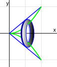

# 📝Definition
The washer method in [[definite integral|integral calculus]] is a method integrating both [[Shell integration|shell method]] and [[Disc integration|disc method]] for calculating the volume of revolution.
# ✒Notation
$$
\begin{align}
dV = \pi (y_{\textrm{outer}}^2 - y_{\textrm{inner}}^2)\, dx.
\end{align}
$$
# 📈Diagram

