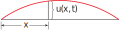

https://mathworld.wolfram.com/WaveEquation.html
# 📝Definition
The wave equation
$$
\frac{\partial^2 u}{\partial t^2}=a^2\frac{\partial^2 u}{\partial x^2}
$$
describes the motion of a waveform, which could be an ocean wave, a sound wave, a light wave, or a wave traveling along a vibrating string.

> [!info] Remark
> For instance, if $u(x, t)$ represents the displacement of a vibrating violin string at time $t$ and at a distance $x$ from one end of the string, then $u(x, t)$ satisfies the wave equation. Here the constant a depends on the density of the string and on the tension in the string.
> 

# 🧠Intuition
Find an intuitive way of understanding this concept.

# 🗃Example
- 📁wave equation example
	- 💬Question: Verify that the function $u(x, t)= \sin(x - at)$ satisfies the wave equation.
	- ✏Solution:
		- Recall what is wave equation.
			- $$\frac{\partial^2 u}{\partial t^2}=a^2\frac{\partial^2 u}{\partial x^2}$$
		- Find $\frac{\partial^2 u}{\partial t^2}$
			- $\frac{\partial u}{\partial t}=-a\cos(x-at)$
			- $\frac{\partial^2 u}{\partial t^2}=-a^2\sin(x-at)$
		- Find $\frac{\partial^2 u}{\partial x^2}$
			- $\frac{\partial u}{\partial x}=\cos(x-at)$
			- $\frac{\partial^2 u}{\partial x^2}=-\sin(x-at)$
		- Verify
			- $$\begin{align}\frac{\partial^2 u}{\partial t^2}&=a^2\frac{\partial^2 u}{\partial x^2}\\-a^2\sin(x-at)&=a^2(-\sin(x-at))\end{align}$$
		- So $u$ satisfies the wave equation.

# 🌱Related Elements
The closest pattern to current one, what are their differences?

# 🍂Unorganized